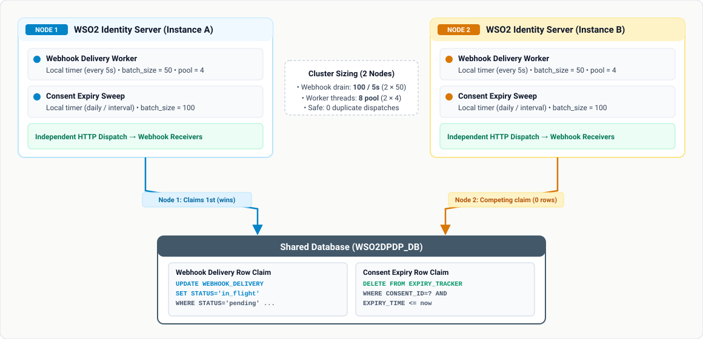

# Configuring the Consent Portal application

Complete this after installing the accelerator and starting the Identity
Server — see [`setup-guide.md`](setup-guide.md) if you haven't done that yet.

The portal is a single page application. It has no backend of its own: it
signs the user in with OpenID Connect and calls the Identity Server's consent
management APIs directly, the same way the built-in My Account application
works. There is **no client secret to configure and nothing to register** —
the application is provisioned automatically, the same way My Account is.

One deployed application serves every tenant, at
`https://<host>:9443/consent-portal/` for the super tenant and
`https://<host>:9443/t/<tenant>/consent-portal/` for the rest, all sharing the
client id `DPDP_CONSENT_PORTAL`.

## 1. Applications and roles are provisioned automatically

For supported tenants — including the super tenant on server startup — the
accelerator registers **DPDP Consent Portal** directly,
with no operator step and no REST call involved. Organization tenants are skipped
by the tenant listener. New applications receive these settings:

| Setting | Value | Why |
|---|---|---|
| Public client | enabled | A single page application cannot keep a secret. |
| PKCE | mandatory | Proves the authorization code was requested by this app. |
| Access token binding | `cookie` | Ties the token to a cookie the page cannot read. |
| Validate token bindings | enabled | A token lifted out of the browser is rejected. |
| Revoke tokens on logout | enabled | Signing out invalidates the tokens immediately. |

It also authorizes the consent-management, consent-history,
event-notification, complaint-management, and account self-service APIs (RBAC)
and creates three organization roles:

- `dpdp-consent-admin` receives the Consent Management catalog and
  administration scopes, all four consent-history scopes, the six portal Event
  Notification management scopes for topics, subscriptions, and events, and
  `complaints:read:any` / `complaints:write:any`.
- `dpdp-consent-user` receives the two self-history scopes,
  `complaints:read:self`, `complaints:write:self`, and `account:self:delete`
  (see [Self-service account deletion](#8-self-service-account-deletion)).
- `dpdp-consent-dpo` receives only `complaints:read:any` and
  `complaints:write:any`, providing organization-wide complaint handling
  without full portal administration.

Basic self-service consent management does not depend on any of these roles;
Identity Server scopes those operations to the authenticated user.

Provisioning checks each of these — application, API authorization, and each
role — individually, creating what's missing and adding any permission a role
is still short of, so it's always safe to re-run (see
[Recovering a broken tenant](#3-recovering-a-broken-tenant) below).

## Verify the portal before configuring optional features

Complete this smoke check immediately after starting Identity Server and
creating a tenant, before configuring email, complaint, expiry, account
deletion, or Event Notification settings.

| Tenant | URL |
|---|---|
| Super tenant | `https://<host>:9443/consent-portal/` |
| Any other tenant | `https://<host>:9443/t/<tenant>/consent-portal/` |

Sign in with a user holding `dpdp-consent-admin` and confirm that the portal
loads and the **Event Notifications** navigation, Topics, and Events pages are
visible. If the portal does not load, resolve the installation, tenant, or
role-assignment issue before continuing with feature configuration.

## 2. Change or turn off the auto-provisioning

Two settings in `deployment.toml` control this, under `[dpdp_accelerator.consent_portal]`:

```toml
[dpdp_accelerator.consent_portal]
auto_provisioning_enabled = true
client_id = "DPDP_CONSENT_PORTAL"
```

| Setting | Default | Change it if... |
|---|---|---|
| `auto_provisioning_enabled` | `true` | You want to manage the application and its roles by hand instead. Set to `false`. This turns off automatic creation and reconciliation of the application and roles — it does not disable the portal or sign-in. |
| `client_id` | `DPDP_CONSENT_PORTAL` | You're changing it, you **must** also update `clientID` in the deployed portal's own `deployment.config.json` — the two have to match or sign-in breaks. |

When `auto_provisioning_enabled` is `false`, the listener skips creation and
reconciliation of the Consent Portal application, its API authorizations, and
the `dpdp-consent-admin`, `dpdp-consent-user`, and `dpdp-consent-dpo` roles.
Configure those items manually in Identity Server before using the portal.
Grant `complaints:read:any` and `complaints:write:any` to the DPO role;
see the [Role Guide](role-guide.md) for the other roles' permissions.

### Consent API Invoker provisioning

A second application supports machine-to-machine calls to the Consent
Management v2 consents resource. It has its own provisioning flag, but the
current listener reaches this step only when Consent Portal provisioning is
enabled. Setting `consent_portal.auto_provisioning_enabled = false` also skips
creation and reconciliation of the Consent API Invoker, even when its own flag
is `true`:

```toml
[dpdp_accelerator.consent_api_invoker]
auto_provisioning_enabled = true
client_id = "DPDP_CONSENT_API_INVOKER"
```

**DPDP Consent API Invoker** is a confidential OAuth client using only the
`client_credentials` grant. It has no browser callback, PKCE, or cookie token
binding. The current implementation authorizes the consents API resource only;
it does not authorize the purposes or elements resources.

Identity Server generates its client secret during provisioning. Retrieve and
rotate that secret through the tenant's application-management UI or API, and
store it in the invoking system's secret manager. The accelerator does not
write the generated secret to a documentation or configuration file.

Set `auto_provisioning_enabled = false` in this separate section if the
machine-to-machine application is not required. This setting does not affect
the browser-facing Consent Portal application.

Edit the value in the accelerator's
`repository/resources/wso2is-7.3.0-deployment.toml` before deploying the
accelerator, or directly in `<IS_HOME>/repository/conf/deployment.toml` after
installation. Restart the server for the change to take effect.

## 3. Recovering a broken tenant

If a tenant's provisioned application or roles get deleted or corrupted,
restore them without a server restart:

1. Confirm that Consent Portal auto-provisioning is enabled.
2. Update a property of the tenant (Console → **Tenant Management** → the
   tenant → **Update**) to reconcile missing applications, API authorizations,
   and role permissions.

Existing applications have their API authorization and roles reconciled;
provisioning does not reset their OAuth settings. If those settings are damaged,
restore them through application management, or recreate the application and
then repeat tenant reconciliation. Preserve existing roles and user assignments;
recreating a deleted role does not restore its former user assignments.

The same tenant update also reconciles the Consent API Invoker when its
provisioning setting is enabled. It is how a tenant provisioned by an older version of the
accelerator picks up a newly introduced scope: re-running provisioning adds
whatever permissions its existing roles are missing, without recreating the
roles or touching any permission an operator granted by hand. A tenant created
before self-service account deletion existed gets `account:self:delete` on
`dpdp-consent-user` this way — no restart, no role deletion.

## 4. Assign portal roles

Roles are assigned in the Console under **User Management → Users → *user* →
Roles**. Roles belong to one tenant, so do this in each tenant.

**Signing in and managing your own consents needs no role at all.** Every
authenticated user gets `internal_login`, and the self-service consent API
scopes every call to the caller, so a user with no portal role can sign in,
see their dashboard and manage their own consents. The three roles below grant
what is *beyond* that.

| Role | Assign to | Grants |
|---|---|---|
| `dpdp-consent-user` | Regular users needing additional self-service features | Viewing their own consent history, deleting their own account, and reading (`complaints:read:self`) and writing (`complaints:write:self`) their own complaints. None is required for basic self-service consent management. |
| `dpdp-consent-admin` | Administrators | Administering other users' consents, editing the purpose and element catalog, managing Event Notifications, viewing consent history, and reading/writing any complaint. **Not** self-service account deletion, which is `dpdp-consent-user` only. |
| `dpdp-consent-dpo` | Data Protection Officers | Reading and writing any complaint in the organization without Consent Management, catalog, consent-history, Event Notification, or account-deletion permissions. |

> **Users who don't hold `dpdp-consent-user` will not see "Delete my
> account".** The option is gated on the `account:self:delete` scope that
> only this role grants, so assign it to every user who should be able to
> delete their own account. Users provisioned before a permission was added to
> the role may need tenant reconciliation and a fresh sign-in; check rather
> than assume.
>
> **Assigning both the admin and user roles re-enables self-deletion.** The
> two roles' permissions add up, so an administrator who also holds
> `dpdp-consent-user` receives `account:self:delete` and can delete their own
> account. Keep administrators out of `dpdp-consent-user` if that matters —
> that role also grants self-service complaint permissions, so review the user's
> other required permissions before changing their assignments.

## 5. Configure email notifications

The Consent Portal can send email notifications through an SMTP server.
Configure the SMTP sender settings in the Identity Server's
`deployment.toml`.

For Gmail or Google Workspace, use the following configuration:

```toml
# SMTP email sender settings.
[output_adapter.email]
from_address = "abc@gmail.com"
username = "abc@gmail.com"
password = "<GMAIL_APP_PASSWORD>"
hostname = "smtp.gmail.com"
port = 587
```

### Configure the recipient's primary email

The user's **primary email address** must be configured in their user profile
for the user to receive email notifications.

In the Console:

1. Go to **User Management → Users**.
2. Select the user.
3. Open the user's profile.
4. Add or update the user's **Primary Email** address.
5. Save the changes.

Make sure the primary email address is valid and accessible. Notifications
sent to the user will be delivered to the configured primary email address.

## 6. Configure complaint management
Complaint deadlines and upload limits are configured in `deployment.toml`:

```toml
[dpdp_accelerator.complaints]
statutory_due_period_days = 90
attachment_max_size_bytes = 10485760
attachment_max_files_per_upload = 5
```

| Setting | Default | Meaning |
|---|---:|---|
| `statutory_due_period_days` | `90` | Number of days after submission when a complaint becomes statutorily due. |
| `attachment_max_size_bytes` | `10485760` | Maximum size of one uploaded complaint attachment. |
| `attachment_max_files_per_upload` | `5` | Maximum number of files accepted in one attachment request. |

Restart Identity Server after changing these server-side limits. Assign
`dpdp-consent-user` for personal complaint self-service,
`dpdp-consent-dpo` for organization-wide complaint handling, or
`dpdp-consent-admin` when complaint access is part of broader administration.
See the [Role Management Guide](role-guide.md).

## 7. Configure periodical consent expiration

Identity Server reports an `ACTIVE` or `PENDING` consent as `EXPIRED` when its
`expiryTime` passes. The accelerator reconciles that transition into an audit record, an enabled history
snapshot, and an enabled lifecycle event. It does not change the source consent.
An API response showing `EXPIRED` alone does not prove that reconciliation or
notification delivery has completed.

Merge these settings into existing TOML sections; do not define the same section
twice. Keep consent history enabled so the consent-management listener maintains
the expiry tracker.

```toml
[dpdp_accelerator.consent_history]
enabled = true
snapshot_enabled = true

[dpdp_accelerator.consent_expiry]
enabled = true
schedule_mode = "daily"
daily_time = "00:00"
# timezone = "Asia/Colombo"
batch_size = 100
max_batches_per_run = 1000
max_run_seconds = 300

[dpdp_accelerator.event_notifications.lifecycle_events]
publishing_enabled = true
```

The settings within `[dpdp_accelerator.consent_expiry]` are:

| Setting | Default | Meaning |
|---|---|---|
| `enabled` | `true` | Enables scheduled and listener-triggered expiry reconciliation. Tracker bookkeeping continues while expiry is disabled, provided consent history keeps the listener enabled. |
| `schedule_mode` | `"daily"` | `daily` or `interval`. |
| `daily_time` | `"00:00"` | Local daily execution time, for example `"00:00"` or `"09:30"`. |
| `timezone` | Server timezone | Java timezone ID for daily scheduling. Configure the same zone across instances. |
| `interval_seconds` | Required in interval mode | Positive delay after a firing finishes, and before the first interval firing. |
| `batch_size` | `100` | Maximum candidates fetched in each SQL query, not a limit on the entire firing. |
| `max_batches_per_run` | `1000` | Maximum fetch iterations within a firing. |
| `max_run_seconds` | `300` | Elapsed-time budget, checked before fetches and between candidates. |

For interval scheduling, set `schedule_mode = "interval"` and, for example,
`interval_seconds = 300`. Each instance uses one scheduler thread and runs at
most one scheduled sweep at a time. The expiry scheduler thread count is not configurable.
Daily time and timezone settings must remain valid even in interval mode, since
the scheduler validates them at startup.

Daily mode schedules the next future occurrence on startup, without replaying
missed firings. During daylight-saving transitions, a nonexistent daily time moves
forward through the gap and a repeated local time runs once. An unfinished backlog
remains eligible at the next firing.

A firing captures a due cutoff, fetches a batch, processes each consent in its own
transaction, and fetches successive pages until a page contains fewer than
`batch_size` rows or a safety limit is reached. Exactly full pages require a final
empty fetch. Ordering by expiry time and consent ID allows the scan to advance
past failures without repeatedly selecting the same records. Failed records remain
pending for a later firing. Concurrent changes may also defer a record to a later
firing. A short page is the end of that scan, not proof that all failed or
concurrently changed due records have been processed.

The elapsed-time limit is a soft budget: an in-progress consent finishes its
commit or rollback before the worker checks the limit and leaves remaining work
for a later firing. It does not interrupt an already blocked database or source
consent call. Configure bounded datasource acquisition, database lock, and JDBC
query/network timeouts for the deployment. The sweep logs the number fetched,
completed, skipped, and failed, and whether it stopped at the end of the scan or
at a limit. Repeated limit warnings indicate that the schedule or limits need
adjustment. Configuration changes require a server restart.

### Transactions and multiple instances

All instances use the shared `WSO2DPDP_DB`. No additional scheduler tables or tracker status column are required. The conditional tracker DELETE matches the
consent, tenant, observed deadline, and due cutoff. Its row lock is held until the
audit and enabled snapshot have been persisted on the same connection, together
with the event, purposes, and matching webhook/poll delivery rows when lifecycle
publication is enabled. One commit makes those writes and the deletion permanent; failure rolls them back together. Competing instances
may fetch the same candidates, but only a successful claimant processes each
tracked deadline. Lock timeouts and deadlocks leave an attempt for a later firing.

Event delivery happens after commit through the existing notification workers;
HTTP delivery is outside the transaction and can be retried. This does not provide
exactly-once HTTP delivery or a shared transaction with the separate IS consent
store. Existing pre-mutation listener hooks remain, but the tracker guard alone
does not eliminate every concurrent consent-renewal race.

### Persisted expiry precision and existing tracker rows

Tracker writes use the expiry read back from the saved consent, so the tracker
matches the source database's timestamp precision. If an existing tracker has a
different deadline, reconciliation conditionally updates it only when its tenant,
consent ID, and old deadline still match. That attempt is counted as skipped;
a subsequent fetch can process the corrected row. A repaired deadline earlier
than the scan cursor is picked up on the next firing.

If the saved consent deadline is in the future, the repaired tracker remains
pending until it is due. The repair does not recreate a deleted tracker or
overwrite one whose deadline another worker has already changed.

## 8. Self-service account deletion

A user holding `dpdp-consent-user` sees **Delete my account** in the portal's
profile menu, beside Sign out. Confirming it calls `DELETE /scim2/Me`, clears
the browser session and lands the user on a public confirmation page. The
deletion is immediate and irreversible — unless an approval workflow is
configured for the operation, in which case it becomes a request; see
[With an approval workflow on Delete User](#with-an-approval-workflow-on-delete-user).

Users without that role do not see the option, and the portal is perfectly
usable without it — so assigning it is a deliberate step, not something
existing accounts have already. See [Assign portal roles](#4-assign-portal-roles).

### How it is restricted

Identity Server protects `DELETE /scim2/Me` with `internal_user_mgt_delete` by
default — a scope that *also* authorizes `DELETE /scim2/Users/{id}`, so
granting it to portal users would let any one of them delete anybody. The
accelerator's `deployment.toml` therefore overrides that one endpoint to
require a much narrower scope instead:

```toml
[[resource.access_control]]
context = "(.*)/scim2/Me"
allowed_auth_handlers = ["OAuthAuthentication"]
secure = "true"
http_method = "DELETE"
scopes = ["account:self:delete"]
```

Tenant provisioning registers `account:self:delete`, authorizes the portal
application for it, and grants it through the `dpdp-consent-user` role only.
`internal_user_mgt_delete` is never granted to portal users, so
`DELETE /scim2/Users/{id}` stays administrator-only.

**The scope check on the token is the enforcement.** The admin role alone does
not grant `account:self:delete`. An otherwise valid token lacking that scope
cannot call `DELETE /scim2/Me`, whether from the portal or another client.
An administrator granted the scope through another role can use the endpoint;
hiding the portal menu is not the server-side control.

### With an approval workflow on Delete User

If an approval workflow is associated with the **Delete User** operation, the
account is not deleted when the user confirms. The Identity Server records a
request and answers `202` with *"User deletion has sent for the approval"*,
and the account stays fully usable — the user can keep working and can sign in
again — until an approver acts.

The portal tells the two outcomes apart by the status code and says which one
happened, because it has no way of knowing in advance whether a workflow is
configured:

| Response | What the portal does |
|---|---|
| `204` | Clears the session and shows the account-deleted page. |
| `202` | Keeps the user signed in and reports that the request is awaiting approval. |
| `400` | Reports that a deletion request is already awaiting approval — the server refuses a second one while the first is pending. |

Approvers act on the request in **My Account** (`/myaccount`) under its
approvals section — accept or reject it there. The Console's **Workflow
Requests** page is a monitoring view: it lists requests and can abort one, but
it does not offer an approve action.

The portal cannot show a user that their own request is pending: the
workflow-request APIs are administrative, and there is no self-service
endpoint for "my pending requests". A user who tries again simply gets the
`400` message above.

### What this does and does not cover

- With the default role grants, users holding only the portal admin role cannot
  delete **their own** account through the portal. It does not restrict Identity
  Server administration: anyone
  holding `internal_user_mgt_delete` can still delete any account, their own
  included, via `/scim2/Users/{id}` and the Console. That is unchanged and
  intended.
- A user holding both portal roles *can* self-delete — see the note in
  [Assign portal roles](#4-assign-portal-roles).
- **The user's DPDP data is not cleaned up.** Deleting the account removes the
  user from the user store; their consent records and event subscriptions stay
  behind, now referencing a user that no longer exists. Purging or anonymising
  that data is a separate operator task today.

### Deployments that override the requested scopes

If your deployment ships its own `scope` array in the portal's
`deployment.config.json` rather than using the shipped one, add
`account:self:delete` to it. A scope the application never asks for is a scope
the token never carries, and the menu item stays hidden.

## 9. Configure Event Notifications

Event Notification Framework runtime settings are configured in the same
`deployment.toml` file under `[dpdp_accelerator.event_notifications]` and its
payload-signing, lifecycle-event, polling, and webhook sub-tables. The
configuration mapper renders these values into `dpdp-accelerator.xml` using the
accelerator template. `DPDPConfigParser` reads that XML, and the shared
`DPDPConfigurationService` supplies the settings to the notification services.

For the user workflow—creating topics and subscriptions, preparing a webhook,
publishing events, and viewing delivery history—see
[`event-notification-guide.md`](event-notification-guide.md).

The following example uses production-oriented callback restrictions. Merge
these keys into existing tables instead of creating duplicate TOML tables.
Restart Identity Server after changing these runtime settings.

```toml
[dpdp_accelerator.event_notifications]
system_topics_auto_create_enabled = true

[dpdp_accelerator.event_notifications.payload_signing]
enabled = true
audience = "dpdp-event-notifications"

[dpdp_accelerator.event_notifications.lifecycle_events]
publishing_enabled = true

[dpdp_accelerator.event_notifications.polling]
default_return_immediately = true
default_max_events = 20
max_events_limit = 100
request_hmac_validation_enabled = false

[dpdp_accelerator.event_notifications.webhook]
thread_pool_size = 4
base_backoff_seconds = 5
max_retries = 5
allow_http_callback_url = false
allowed_callback_ports = "-1,443,8443"
allow_private_network_callback_targets = false
delivery_worker_batch_size = 50
delivery_worker_poll_seconds = 5
stuck_inflight_threshold_seconds = 10
max_verification_response_body_bytes = 4096
pending_subscription_recovery_threshold_seconds = 60
background_worker_initial_delay_seconds = 10
pending_subscription_recovery_interval_seconds = 30
pending_subscription_recovery_batch_size = 20
worker_shutdown_timeout_seconds = 5
```

`system_topics_auto_create_enabled` controls whether the five predefined topics
are reconciled for each tenant. `lifecycle_events.publishing_enabled` controls
whether matching consent and user lifecycle actions automatically publish
events to those topics; it defaults to `true`. Topic creation and lifecycle
publication are independent settings: a topic can exist while automatic
publication is disabled. The `user.data.change` and `user.account.delete`
publishers also require the `dpdpUserLifecycleEventHandler` subscription shown
in the [Event Notification Guide](event-notification-guide.md#enabling-userdatachange--useraccountdelete).

Consent update/revoke callbacks and new expiry tracking also require
`[dpdp_accelerator.consent_history] enabled = true` in the current
implementation. `snapshot_enabled = false` only disables full snapshots; it
does not disable those callbacks. Expiry notifications additionally require
the [expiry configuration](#7-configure-periodical-consent-expiration).
There is no single global Event Notification enable switch: topic creation,
lifecycle publishing, payload signing, and receiver access are separate controls.

### Local development callback settings

The shipped template allows HTTP and ports `80` and `8443`; the production
example above deliberately restricts HTTP. For a disposable LAN receiver only,
override these keys in the existing webhook table:

```toml
[dpdp_accelerator.event_notifications.webhook]
allow_http_callback_url = true
allowed_callback_ports = "-1,80,443,8443"
allow_private_network_callback_targets = true
```

Use the receiver machine's reachable LAN address, for example
`http://<receiver-lan-ip>:8443/dpdp/events`. `localhost`, loopback, wildcard,
and multicast callback addresses are rejected even with this override. Open
only the required network path from Identity Server to the receiver. Restore
the production restrictions after testing; do not expose the sample's plain
HTTP port directly to the Internet.

These are server-wide runtime settings. Subscription `sharedSecret` values
remain per-subscription data and are not placed in `dpdp-accelerator.xml`.
The shipped `wso2is-7.3.0-deployment.toml` is the source of truth for defaults;
see the [Event Notification Guide](event-notification-guide.md) for the
security and operational meaning of the polling, signing, verification, and
delivery settings.

## 10. Multi-node clustering and background jobs

When Identity Server is deployed across multiple nodes in an active-active cluster, the accelerator's background jobs—the **consent-expiry sweep** and the **webhook delivery worker**—run concurrently across all instances without requiring dedicated clustering setup.



### Independent node execution (No leader election)

- **Independent local timers:** Each node runs its own background scheduler on its own timer. There is no leader election, cluster coordinator, or concept of a single "active" node. Every node actively processes work in parallel.
- **Zero clustering setup:** The accelerator requires no complex clustering configuration, cluster heartbeat flags, or coordination plugins. All nodes simply connect to the same shared database (`WSO2DPDP_DB`).

### Concurrency and safe claiming

To prevent duplicate processing across competing nodes, both jobs rely on atomic, row-level database claims:

- **Webhook deliveries:** Before dispatching an HTTP request, a worker issues a conditional database update to flip the delivery row from `pending` to `in_flight`. If multiple nodes select the same delivery simultaneously, only the first node's update succeeds (affecting 1 row); all competing nodes receive 0 affected rows and safely move on without duplicating the HTTP call.
- **Consent expirations:** When processing an expired consent, a node conditionally deletes the corresponding tracker record. Only the single node that successfully claims the row proceeds to write the audit and lifecycle records within that transaction.

### Sizing and throughput scaling

All background worker settings in `deployment.toml` are **per-instance limits, not cluster-wide totals**:

- **Throughput scales linearly (`N × value`):** If you configure `delivery_worker_batch_size = 50` and `delivery_worker_poll_seconds = 5`, a 3-node cluster will drain up to 3 × 50 = 150 deliveries every 5 seconds.
- **Worker pool sizing:** Setting `thread_pool_size = 4` allocates 4 HTTP delivery threads on *each* node (12 concurrent HTTP dispatches across a 3-node cluster).
- Sizing decisions should account for total cluster capacity and the capacity of the target database and downstream webhook receivers.
