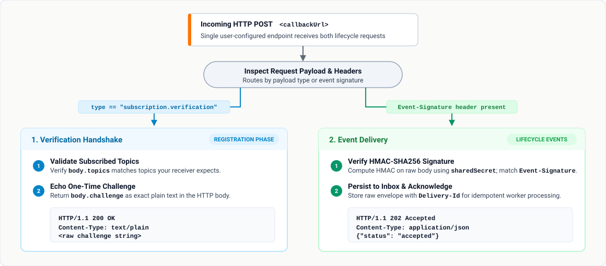

# Using Event Notifications

Complete this after installing the accelerator, configuring the Consent Portal,
and assigning the `dpdp-consent-admin` role — see
[`setup-guide.md`](setup-guide.md) and
[`configuration-guide.md`](configuration-guide.md) if you have not done that
yet.

Event Notifications let an application publish an event to a topic and deliver
that event to matching subscribers. Topics, subscriptions, events, and delivery
history are isolated by Identity Server tenant.

## 1. Before you begin

You need:

- A running Identity Server with the DPDP Accelerator installed.
- A user with the `dpdp-consent-admin` role in the tenant you want to manage.
- An OAuth access token with the scopes required for any direct API calls.
- A publicly reachable HTTPS endpoint if you use webhook delivery.

The automatically provisioned `dpdp-consent-admin` role contains the six Event
Notification management scopes for topics, subscriptions, and events. The
automatically provisioned `dpdp-consent-user` and `dpdp-consent-dpo` roles do
not contain Event Notification scopes. Identity Server registers the polling
and delivery-completion scopes, but these receiver scopes are not assigned to
any of the three portal roles.

| Operation | Required scope | Automatically provisioned role |
|---|---|---|
| View topics | `notifications:topics:read` | `dpdp-consent-admin` |
| Create or deregister topics | `notifications:topics:write` | `dpdp-consent-admin` |
| View subscriptions | `notifications:subscriptions:read` | `dpdp-consent-admin` |
| Create, verify, or delete subscriptions | `notifications:subscriptions:write` | `dpdp-consent-admin` |
| View events and delivery history | `notifications:events:read` | `dpdp-consent-admin` |
| Publish events | `notifications:events:write` | `dpdp-consent-admin` |
| Poll event deliveries | `notifications:events:poll` | None |
| Submit delivery completion | `notifications:event-deliveries:complete` | None |

“None” means the scope exists in Identity Server but is not assigned to an
automatically provisioned portal role. Assign receiver scopes explicitly to a
dedicated application-to-application role when the integration requires them.

### Configure publisher and receiver roles

For application-to-application access, create separate least-privilege roles
instead of assigning `dpdp-consent-admin` to publishing and receiving users:

| Role | Assign these scopes |
|---|---|
| `event-publisher` | `notifications:events:write` |
| `event-receiver` | `notifications:events:poll`, `notifications:event-deliveries:complete` |

Create separate publisher and receiver users, assign only the corresponding
role, and obtain fresh access tokens after role assignment. Use the publisher
token for `POST /events` and the receiver token for `POST /events/poll` and
`POST /deliveries/{deliveryId}/completion`. As negative checks, the receiver
token must receive HTTP `403` when publishing, while the publisher token must
receive HTTP `403` when polling or submitting completion.

The Identity Server provisioning flow also creates `dpdp-consent-admin`,
`dpdp-consent-user`, and `dpdp-consent-dpo`. The administrator role receives the
six topic, subscription, and event management scopes; the user and DPO roles do
not receive Event Notification scopes. None of these roles receives
`notifications:events:poll` or
`notifications:event-deliveries:complete`. The `event-publisher` and
`event-receiver` roles above are least-privilege recommendations that an
operator must create and assign manually.

### Tenant-specific URLs

Use the URL for the tenant whose data you want to access:

| Tenant | Portal URL | Event Notification API base URL |
|---|---|---|
| Super tenant | `https://<host>:9443/consent-portal/` | `https://<host>:9443/api/dpdp/event-notifications/v1` |
| Any other tenant | `https://<host>:9443/t/<tenant>/consent-portal/` | `https://<host>:9443/t/<tenant>/api/dpdp/event-notifications/v1` |

For example, the API base URL for tenant `example.com` is:

```text
https://is.example.com:9443/t/example.com/api/dpdp/event-notifications/v1
```

The server extracts the tenant domain from the tenant-qualified request and
places it in the Carbon tenant context. The Event Notification endpoints then
use that context as the organization identifier. Do not send a tenant or
organization ID in a request body to select another tenant; it will not replace
the request's tenant context.

The examples below use these shell variables:

```sh
IS_BASE_URL="https://is.example.com:9443"
TENANT_DOMAIN="example.com"
API_BASE="${IS_BASE_URL}/t/${TENANT_DOMAIN}/api/dpdp/event-notifications/v1"
GROUP_ID="${TENANT_DOMAIN}"
ACCESS_TOKEN="<access-token>"
PUBLISHER_ACCESS_TOKEN="<event-publisher-access-token>"
RECEIVER_ACCESS_TOKEN="<event-receiver-access-token>"
```

For the super tenant, set `API_BASE` without the `/t/<tenant>` segment.

The examples use certificates trusted by the client. For a local Identity
Server using a self-signed certificate only, add `-k` to a `curl` command
temporarily. Do not use `-k` for deployed environments; configure a trusted CA
or pass it explicitly with `--cacert` instead.

## 2. Understand the notification flow

Events reach the framework in two ways:

- **Automatic lifecycle publication:** with lifecycle publication enabled (the
  default), the accelerator publishes an event when the corresponding consent
  or user lifecycle action occurs for one of the five predefined system topics.
- **Explicit API publication:** an authorized publisher calls `POST /events`,
  normally for a user-created topic or another intentional publication.

The normal webhook flow is:

1. The Data Fiduciary creates a topic.
2. The Data Fiduciary registers a webhook subscription on behalf of the Data Processors for that topic.
3. Identity Server verifies the subscriber's callback URL.
4. A matching lifecycle action publishes the event automatically, or an Event
   Publisher (the Data Fiduciary or an external publisher) sends it explicitly
   with a `group-id` header.
5. The accelerator matches the event to active subscriptions and sends a
   signed webhook request.
6. An administrator can inspect the event and delivery history in the portal.

| Resource | Purpose |
|---|---|
| Topic | A named event category, such as `consent-status-changed`. |
| Subscription | Associates one or more topics with one shared purpose filter and delivery configuration. |
| Event | The payload published to a topic for a group. |
| Delivery | One subscription-specific attempt to deliver an event. |

## 3. Create and manage topics

In the Consent Portal, open **Event Notifications → Topics**. From this page you
can search and filter topics, register a topic, or deregister a user-created
topic.

### Automatically provisioned system topics

When an ordinary WSO2 tenant is created, the accelerator creates these topics
for that tenant:

| Topic | Description | Automatic publication trigger | Has a purpose? |
|---|---|---|---|
| `consent.update` | Consent update and state transition notifications. | A consent is updated, or an authorization is approved or rejected. | Yes |
| `consent.revoke` | Consent revocation and withdrawal notifications. | A consent or its authorization is revoked through a lifecycle path that invokes the DPDP consent listener. | Yes |
| `consent.expire` | Consent expiration notifications. | The expiry reconciler records a due consent as expired. | Yes |
| `user.data.change` | User data modification and profile change notifications. | Identity Server completes a user-claim update. | No |
| `user.account.delete` | User account deletion and right-to-be-forgotten notifications. | Identity Server completes a user deletion. | No |

Automatic publication is enabled by default with `publishing_enabled = true`
under `[dpdp_accelerator.event_notifications.lifecycle_events]`.
The lifecycle action creates the Event Notification event automatically; an
administrator or external publisher does not need to call `POST /events` for
that occurrence. A delivery is created only for an active subscription whose
tenant, group, topic, and purpose filter match the event.

These topics are marked as managed by the system. A portal administrator can
use them for subscriptions and events but cannot deregister them. The portal
disables their deregistration action, and the API rejects direct deletion
attempts.

**About the "Has a purpose?" column:** a subscription's purpose filter (see
[§5](#register-a-webhook-subscription)) only works if the event actually
carries a purpose. The 3 consent topics do. `user.data.change` and
`user.account.delete` don't — a user isn't tied to one processing purpose the
way a consent is. So use the `all` filter when subscribing to those 2 topics;
`specific`/`all_except` will simply never match anything on them.

Topic provisioning is independent of Consent Portal auto-provisioning. The
system-topic step does not create or assign any user, group, or role. Consent
Portal auto-provisioning separately creates its application roles, but role
membership remains a manual administrator action. Updating the tenant safely
reconciles any missing system topic without creating duplicates. For
`carbon.super`, the server startup observer invokes the same provisioning flow
after startup. The five system topics are therefore also created for the super
tenant when `system_topics_auto_create_enabled` is `true`.

#### Enabling `user.data.change` / `user.account.delete`

With the shipped defaults, consent callbacks and expiry tracking are enabled
through `consent_history.enabled`, and the expiry reconciler is enabled through
`consent_expiry.enabled`. Keep lifecycle publishing enabled as well. These two
user topics additionally need this setting in `deployment.toml`:

```toml
[[event_handler]]
name = "dpdpUserLifecycleEventHandler"
subscriptions = ["POST_DELETE_USER", "POST_SET_USER_CLAIMS"]
```

Already included if you installed with `bin/configure.sh` — nothing to do.
If you manage `deployment.toml` yourself, add this block and restart the
server. Without it, these 2 topics stay silent: no events ever publish to
them.

### Register a user topic

To create a topic through the API:

```sh
curl --request POST "${API_BASE}/topics" \
  --header "Authorization: Bearer ${ACCESS_TOKEN}" \
  --header "Content-Type: application/json" \
  --data '{
    "name": "consent-status-changed",
    "description": "Changes to the status of a consent"
  }'
```

A newly created topic is `active`. Topic names must be unique within the
tenant.

To list active topics:

```sh
curl "${API_BASE}/topics?status=active&limit=20&offset=0" \
  --header "Authorization: Bearer ${ACCESS_TOKEN}"
```

List responses use this pagination shape:

```json
{
  "items": [],
  "total": 0
}
```

To deregister a user-created topic:

```sh
curl --request DELETE "${API_BASE}/topics/<topic-id>" \
  --header "Authorization: Bearer ${ACCESS_TOKEN}"
```

A topic cannot be deregistered while it has active subscriptions. System-created
topics cannot be deregistered by users.

## 4. Prepare a webhook receiver

When creating a webhook subscription, you specify a **`callbackUrl`** (e.g. `https://subscriber.example.com/events`, `https://subscriber.example.com/api/v1/webhook`, etc.). The URL path is completely user-configurable.

Identity Server sends all HTTP `POST` requests directly to this `callbackUrl`. The single endpoint handles two distinct phases:

1. **Verification Handshake:** Sent upon subscription registration or retry to verify endpoint ownership.
2. **Event Delivery:** Sent when events matching your subscription occur.


### Respond to verification

Identity Server verifies a callback URL by sending an HTTP `POST` request to your `callbackUrl` with `Content-Type: application/json`:

```json
{
  "type": "subscription.verification",
  "subscriptionId": "<subscription-id>",
  "topics": ["consent.update", "consent.revoke"],
  "challenge": "<one-time-challenge>"
}
```

The `topics` array contains the subscribed topic names for this subscription.

**What your receiver must do:**
1. Check `body.type`: if it equals `"subscription.verification"`, handle this as a verification challenge (do not process as an event delivery).
2. Validate that `body.topics` matches the topics your receiver is configured to accept.
3. Respond with **HTTP `200 OK`**, `Content-Type: text/plain`, and the exact **`challenge`** string as the response body.

Surrounding whitespace is ignored, but additional characters or JSON formatting cause verification to fail. A failed attempt can be retried. The subscription becomes `active` once this check passes.

### Receive and verify deliveries

An event delivery is an HTTP `POST` with `Content-Type: application/json` and
these headers:

| Header | Description |
|---|---|
| `Delivery-Id` | Stable delivery identifier. Use it to reject duplicate processing. |
| `event-signature` | `sha256=<hex HMAC-SHA256>` computed using the subscription's shared secret. |

With payload signing enabled (the default), the body contains only the compact
tenant-signed JWS:

```json
{
  "signedPayload": "<base64url-header>.<base64url-claims>.<base64url-signature>"
}
```

The decoded JWS claims have the following shape:

```json
{
  "iss": "https://is.example.com:9443/t/example.com/oauth2/token",
  "sub": "example-group",
  "aud": "dpdp-event-notifications",
  "iat": 1787651970,
  "jti": "<delivery-id>",
  "txn": "<event-id>",
  "payloadHash": "<HMAC-SHA256 of the embedded payload>",
  "payload": {
    "deliveryId": "<delivery-id>",
    "eventId": "<event-id>",
    "subscriptionId": "<subscription-id>",
    "orgId": "example.com",
    "groupId": "example-group",
    "topic": "consent-status-changed",
    "eventPayload": {
      "consentId": "c7c6b814-ef76-4eb4-9494-8af1b98a9ed1",
      "status": "REVOKED"
    }
  }
}
```

First compute HMAC-SHA256 over the exact raw request-body bytes, using the shared
secret as the key. Compare `sha256=<computed lowercase hex value>` with the
`event-signature` header using a constant-time comparison. Do not reserialize
the outer JSON before verification because whitespace and field order change
the signature. Then verify the compact JWS with the certificate identified by
its `kid`/`x5t#S256` protected headers. The `kid` must match an entry from the
trusted JWKS endpoint for the tenant, and `iss` must exactly match the issuer
configured by Identity Server for that tenant. Maintain this issuer-to-JWKS
mapping in trusted receiver configuration; never fetch keys from an arbitrary
location derived from an unverified JWS. The super tenant normally uses
`/oauth2/token` and `/oauth2/jwks` without `/t/carbon.super`.

Validate `iss`, `sub`, `aud`, `iat`, `jti`, and `txn`, and process the event
from `payload.eventPayload`. The event payload is intentionally not repeated
outside the JWS. Receivers that previously accepted a bare tenant domain in
`iss` must be updated to accept the configured Identity Server issuer.

Restrict the accepted signing algorithm to `RS256`. Check that `jti`, the
`Delivery-Id` header, and `payload.deliveryId` agree; likewise match `txn` to
`payload.eventId`. Check the expected tenant, group, topic, and subscription
before handing `payload.eventPayload` to the business application. Keep an
operator-controlled signing-key cache and refresh it from the trusted tenant
JWKS endpoint during key rotation; an unknown key must not bypass verification.

### Acceptance, retries, and processing responsibilities

Return a `2xx` response only after durable acceptance, for example after
committing the verified event to an inbox database or durable queue. The sender
currently waits up to five seconds for the HTTP request. Perform long-running
business work asynchronously after that commit.

| Receiver outcome | HTTP response | What happens next |
|---|---|---|
| Verified event committed to the inbox | `202` or another `2xx` | Sender records delivery as `delivered`; your worker processes the accepted event. |
| Same verified delivery already accepted | `2xx` | Acknowledge it again without repeating the business operation. |
| Invalid signature or unexpected tenant/subscription | `401` or `403` | Reject it; investigate the configuration or sender. |
| Storage unavailable before acceptance | `503` | Sender retries according to its configured retry policy. |

Every non-`2xx` response, including `4xx`, and transport failure follows the
sender's retry policy. With `max_retries = 5`, there are at most six attempts.
The current backoff is `base_backoff_seconds × 3^(retry number - 1)`; worker
scheduling can delay an attempt further. Exhausted deliveries become `failed`
and require operator investigation. Do not expect a redirect or a `409`
duplicate response to count as success.

Use a durable uniqueness constraint on `Delivery-Id` and retain deduplication
records across process restarts and any permitted replay window. A timeout can
occur after your inbox commit, and sender-side recovery can resend a delivery.
The HTTP body may be signed again on retry, so deduplicate by delivery ID,
not by the body bytes. Do not assume deliveries arrive in order.

A `2xx` response proves acceptance, not completed business work. Your worker
must retry or quarantine failures after acceptance, make its business effects
idempotent, and retain processing outcomes. If you use completion evidence,
submit it only after processing, using the separate
[completion API](#submit-webhook-delivery-completion). The sender can briefly
still have the delivery in flight after your HTTP response; wait for its
`delivered` state before reporting completion. A completion report does not
replace the original HTTP acknowledgement.

For production deployments, use HTTPS and a certificate trusted by Identity
Server. HTTP callback URLs should be enabled only for controlled development
environments through the Event Notification settings described in
[`configuration-guide.md`](configuration-guide.md#9-configure-event-notifications).

### Run a sample reference listener {#run-the-sample-listener}

To help you test immediately without writing custom receiver code, reference implementations are provided in both **Python** and **Node.js**. Both implementations use only built-in standard libraries—**no package manager, virtual environment, or external dependencies (`pip` or `npm`) are required**:

* **Python (3.9+ or higher; Python 3.10+ recommended):** [`webhook-listener.py`](pathname:///examples/webhook-listener.py) (uses standard libraries `http.server`, `hmac`, `hashlib`, `json`, `base64`)
* **Node.js (18+ or higher; Node.js 20+ LTS recommended):** [`webhook-listener.mjs`](pathname:///examples/webhook-listener.mjs) (uses built-in `node:http`, `node:crypto`)
* **Contract definition:** [`webhook-listener.openapi.yaml`](pathname:///examples/webhook-listener.openapi.yaml)

Both listeners automatically handle the verification handshake by echoing `challenge` with HTTP 200,
verify incoming HMAC-SHA256 signatures when `SHARED_SECRET` is set, and log the complete formatted
verification and event payloads directly to terminal stdout in real time.

From a repository checkout, their paths are:
* `docs/static/examples/webhook-listener.py`
* `docs/static/examples/webhook-listener.mjs`

#### Step-by-step setup:

1. **Configure your shared secret and start the listener:**
   Choose a shared secret (you will supply this same secret when registering the subscription in the Consent Portal):

   * **Using Python:**
     ```bash
     export SHARED_SECRET="$(openssl rand -hex 32)"
     echo "Your Shared Secret: ${SHARED_SECRET}"

     python3 docs/static/examples/webhook-listener.py
     ```

   * **Using Node.js:**
     ```bash
     export SHARED_SECRET="$(openssl rand -hex 32)"
     echo "Your Shared Secret: ${SHARED_SECRET}"

     node docs/static/examples/webhook-listener.mjs
     ```

   By default, the listener starts on `http://127.0.0.1:8443/dpdp/events` (customize `PORT`, `HOST`, or `CALLBACK_PATH` via environment variables if desired). Expose the endpoint at a reachable address matching your subscription's `callbackUrl`.

2. **Register the subscription:**
   In the Consent Portal, register the subscription with your matching `callbackUrl` and the shared secret printed above. Identity Server immediately sends a verification request, which the listener logs and approves with HTTP 200.

3. **Observe live event deliveries in your terminal:**
   Whenever an event occurs on your subscribed topics, Identity Server delivers the event to your callback URL. The listener verifies the HMAC-SHA256 signature, pretty-prints the decoded event payload directly to the console, and responds with HTTP `202 Accepted`.

Production receivers should persist incoming events to a durable inbox or message queue, deduplicate by `Delivery-Id`, verify tenant JWS signatures against Identity Server's JWKS endpoint, and acknowledge HTTP 202 before delegating work to asynchronous business workers.

## 5. Register a subscription

### Register a webhook subscription

In the Consent Portal, open **Event Notifications → Subscriptions** and select
**Register Subscription**. Choose the subscribed topics (between 1 and 100 unique active topics),
a purpose filter, `webhook` delivery, the callback URL, and a shared secret. Save the secret in the webhook
receiver's secret store before submitting the form.

Purpose filters behave as follows:

| Filter | Matching events |
|---|---|
| `all` | Every event on the topic. |
| `specific` | Events containing at least one listed purpose. |
| `all_except` | Events containing at least one purpose that is not listed. |

`specific` and `all_except` require at least one purpose. Purpose matching is
case-insensitive. A subscription containing `user.account.delete` or `user.data.change`
requires the `all` purpose filter. Topics are fixed at creation. A tenant and group cannot
mix webhook and poll subscriptions for the same topic. Duplicate or overlapping webhook
subscriptions using the same callback URL are also rejected. Referenced topics cannot
be deregistered while any subscription referencing them is active, pending, or stale.

To register a webhook subscription through the API:

```sh
curl --request POST "${API_BASE}/subscriptions" \
  --header "Authorization: Bearer ${ACCESS_TOKEN}" \
  --header "Content-Type: application/json" \
  --data '{
    "topics": ["consent.update", "consent.revoke"],
    "filter": {
      "type": "specific",
      "purposes": ["account-management"]
    },
    "delivery": {
      "mode": "webhook",
      "callbackUrl": "https://subscriber.example.com/dpdp/events",
      "sharedSecret": "<strong-random-secret>"
    }
  }'
```

The subscription starts in `pending`. It becomes `active` only after the
callback returns the verification challenge successfully. If verification is
exhausted, the subscription becomes `stale`.

To retry verification after fixing the receiver:

```sh
curl --request POST "${API_BASE}/subscriptions/<subscription-id>/verify" \
  --header "Authorization: Bearer ${ACCESS_TOKEN}"
```

You can also open the subscription details in the portal and select **Verify**.

### Register a poll subscription

A poll subscription does not use a callback URL and becomes active immediately.
It still requires a strong shared secret for request HMAC validation and
outgoing event-envelope hashing. Store the secret securely before submitting
the request because service responses do not return it.

```sh
curl --request POST "${API_BASE}/subscriptions" \
  --header "Authorization: Bearer ${ACCESS_TOKEN}" \
  --header "Content-Type: application/json" \
  --data '{
    "topics": ["consent-status-changed"],
    "filter": {
      "type": "all",
      "purposes": []
    },
    "delivery": {
      "mode": "poll",
      "sharedSecret": "<strong-random-secret>"
    }
  }'
```

Retain the returned `subscriptionId` and the supplied shared secret. Both are
required when polling for deliveries.

## 6. Publish an event

For tenants where the five predefined lifecycle topics exist, events are
published automatically when their corresponding lifecycle actions occur and
automatic publication is enabled. Use the API below for user-created topics or
when an application intentionally publishes an event itself; do not duplicate
an automatically generated lifecycle event by publishing it again manually.

Publish only to an active topic. The `group-id` header is required and controls
which group-scoped subscriptions can receive the event. With subscriptions
created by the current API, use the current tenant domain as the group ID.

```sh
curl --request POST "${API_BASE}/events" \
  --header "Authorization: Bearer ${PUBLISHER_ACCESS_TOKEN}" \
  --header "Content-Type: application/json" \
  --header "group-id: ${TENANT_DOMAIN}" \
  --data '{
    "topic": "consent-status-changed",
    "purposes": ["account-management"],
    "payload": {
      "consentId": "c7c6b814-ef76-4eb4-9494-8af1b98a9ed1",
      "status": "REVOKED"
    }
  }'
```

The event and its matching delivery records are created atomically. Only active
subscriptions on the same tenant, group, and topic whose purpose filter matches
the event are selected.

## 7. Process deliveries

How a consumer processes a delivery depends on the subscription's delivery
mode. Webhook consumers receive pushed deliveries and may submit completion
evidence. Poll consumers request pending deliveries and acknowledge them or
report processing errors in a later poll request.

### Submit webhook delivery completion

Webhook consumers can submit a signed completion report to
`POST /deliveries/{deliveryId}/completion` with the
`notifications:event-deliveries:complete` scope. The request body is signed
using the subscription shared secret and the
`event-signature: sha256=<hex>` header. The signature input binds the completion
to its path delivery identifier:

```text
v1\ncompletion\n<deliveryId>\n<exact-request-body>
```

Clients must preserve the body bytes exactly after calculating the signature;
changing whitespace or field order invalidates it. A signature generated for
one delivery cannot be reused for another delivery. Body-only completion
signatures are not accepted. The body contains `completionStatus`,
`completionEvidence`, and an optional `completedAt` epoch-millisecond value.
Completion is accepted only after the webhook delivery reaches `delivered`.
`completionEvidence` must be an absolute HTTPS URL without credentials or a
fragment and must not exceed 512 characters. A second completion for the same
delivery returns `EN-4090` with HTTP `409 Conflict`.

An accepted completion returns HTTP `204 No Content` with an empty response
body. Unknown deliveries, group mismatches, and invalid signatures return the
same `401 / EN-4010` response so an unauthenticated caller cannot discover a
delivery or its state.

For example, a client can calculate and submit the contextual signature with:

```bash
DELIVERY_ID="<delivery-id>"
COMPLETION_SHARED_SECRET="<subscription-shared-secret>"
COMPLETION_BODY='{"completionStatus":"completed","completionEvidence":"https://processor.example/evidence/receipt.pdf"}'
COMPLETION_SIGNATURE=$(printf 'v1\ncompletion\n%s\n%s' "${DELIVERY_ID}" "${COMPLETION_BODY}" \
  | openssl dgst -sha256 -hmac "${COMPLETION_SHARED_SECRET}" | awk '{print $2}')

curl -X POST "${API_BASE}/deliveries/${DELIVERY_ID}/completion" \
  -H "Authorization: Bearer ${RECEIVER_ACCESS_TOKEN}" \
  -H "group-id: ${GROUP_ID}" \
  -H "event-signature: sha256=${COMPLETION_SIGNATURE}" \
  -H "Content-Type: application/json" \
  -d "${COMPLETION_BODY}"
```

### Poll event deliveries

Polling uses short, stateless request-response semantics and is scoped to one
subscription. A poll request may acknowledge previously received deliveries,
report structured errors, and request pending deliveries in the same call.
DPDP does not perform long polling, so `returnImmediately=false` is rejected.

The `ack` array contains delivery IDs, while the `setErrs` object is keyed by
delivery ID; neither uses an event ID. Each delivery belongs to one
subscription, so this prevents an acknowledgement for one subscription from
updating another subscription's delivery of the same event. Only pending
deliveries belonging to the request's tenant, group, and requested
subscription are updated. A delivery ID must not appear in both `ack` and
`setErrs`.

The first poll may have an empty request body. When request HMAC validation is
enabled, calculate the signature over the exact bytes sent: an empty request is
the zero-length byte sequence, not `{}`. The service verifies those bytes first
and only then applies the same defaults as an empty JSON object. Whitespace-only
bodies follow the same rule and must be signed with their exact whitespace.

Example:

```sh
POLL_SUBSCRIPTION_ID="<poll-subscription-id>"
POLL_SHARED_SECRET="<poll-subscription-shared-secret>"
POLL_BODY='{
  "orgId": "example.com",
  "maxEvents": 20,
  "returnImmediately": true,
  "ack": ["delivery-that-succeeded"],
  "setErrs": {
    "delivery-that-failed": {
      "err": "authentication_failed",
      "description": "Unable to authenticate the signed event"
    }
  }
}'
POLL_SIGNATURE="sha256=$(printf %s "${POLL_BODY}" | openssl dgst -sha256 -hmac "${POLL_SHARED_SECRET}" -hex | awk '{print $2}')"

curl -X POST "${API_BASE}/events/poll" \
  -H "Authorization: Bearer ${RECEIVER_ACCESS_TOKEN}" \
  -H "Content-Type: application/json" \
  -H "group-id: ${GROUP_ID}" \
  -H "subscription-id: ${POLL_SUBSCRIPTION_ID}" \
  -H "event-signature: ${POLL_SIGNATURE}" \
  -d "${POLL_BODY}"
```

The response contains `sets`, keyed by `deliveryId`, and `moreAvailable`. Each
SET value is a compact RS256 JWS built with the tenant signing key using the
same event envelope as webhook delivery. Clients should retain the key and use
it in a later poll request's `ack` or `setErrs` field. For example:

```json
{
  "moreAvailable": false,
  "sets": {
    "f5f37c64-6130-4d44-9463-136c8bca4278": "<compact-RS256-JWS>"
  }
}
```

When there are no pending deliveries, the response is:

```json
{
  "moreAvailable": false,
  "sets": {}
}
```

Polling defaults and request HMAC enforcement are configured in
`deployment.toml`:

```toml
[dpdp_accelerator.event_notifications.polling]
default_return_immediately = true
default_max_events = 20
max_events_limit = 100
request_hmac_validation_enabled = false
```

When HMAC validation is enabled, `event-signature` is mandatory and is verified
over the exact request body using the selected poll subscription's shared
secret. Poll subscriptions always require a shared secret because the same
secret is used to hash the outgoing event envelope before tenant-key signing.
An omitted `maxEvents` uses the configured default; `maxEvents=0` is an
acknowledge-only request. Values above `max_events_limit` are rejected.

## 8. Inspect events and delivery history

Open **Event Notifications → Events** in the portal to view published events.
Select an event to inspect its payload and subscription-specific deliveries.
Open a subscription to see deliveries associated with that subscription and
their audit history.

The corresponding read APIs are:

| Operation | Method and path |
|---|---|
| List events | `GET /events` |
| Get an event | `GET /events/{eventId}` |
| List deliveries for an event | `GET /events/{eventId}/deliveries` |
| Get delivery history | `GET /events/{deliveryId}/history` |
| List deliveries for a subscription | `GET /subscriptions/{subscriptionId}/events` |
| Get a subscription delivery history | `GET /subscriptions/{subscriptionId}/events/{deliveryId}` |

For example:

```sh
curl "${API_BASE}/events/<event-id>/deliveries?limit=20&offset=0" \
  --header "Authorization: Bearer ${ACCESS_TOKEN}"
```

## 9. Delete a subscription

Delete a subscription from its row or details page in the Consent Portal, or
use:

```sh
curl --request DELETE "${API_BASE}/subscriptions/<subscription-id>" \
  --header "Authorization: Bearer ${ACCESS_TOKEN}"
```

Deletion changes the subscription to `deleted`; it does not erase its existing
event and delivery audit history.

## 10. Troubleshooting

| Symptom | Check |
|---|---|
| Event Notification pages are not visible | Confirm the user has `dpdp-consent-admin` in the current tenant, then sign in again to obtain a token with the Event Notification scopes. |
| A request returns `401` or `403` | Confirm the access token belongs to the URL's tenant and contains the operation's required scope. |
| No topics appear when registering a subscription | Create a topic and confirm it is `active`. |
| Subscription remains `pending` or becomes `stale` | Confirm the callback is reachable from Identity Server and returns the exact verification challenge with HTTP `200`. Then retry verification. |
| Subscription creation returns `409` | Check for an existing or overlapping subscription for the same topic and purposes, and delete the conflicting subscription if it is no longer needed. |
| A system topic exists but no automatic lifecycle events appear | Confirm `lifecycle_events.publishing_enabled = true`. Consent callbacks and expiry tracking currently require `consent_history.enabled = true`; expiry reconciliation also requires `consent_expiry.enabled = true`. For user topics, confirm the `dpdpUserLifecycleEventHandler` subscriptions. |
| Event is created but no delivery appears | Confirm the subscription is `active`, the topic and purpose filters match, and `group-id` equals the subscription's group ID. |
| Webhook signature does not match | Compute the HMAC over the unmodified raw request body, not only the nested `payload`. |
