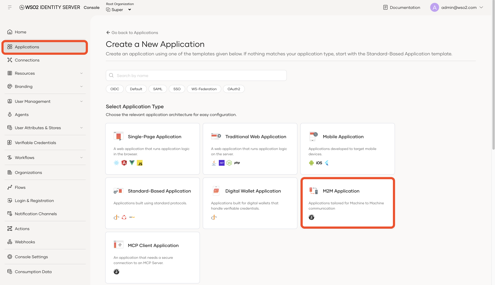
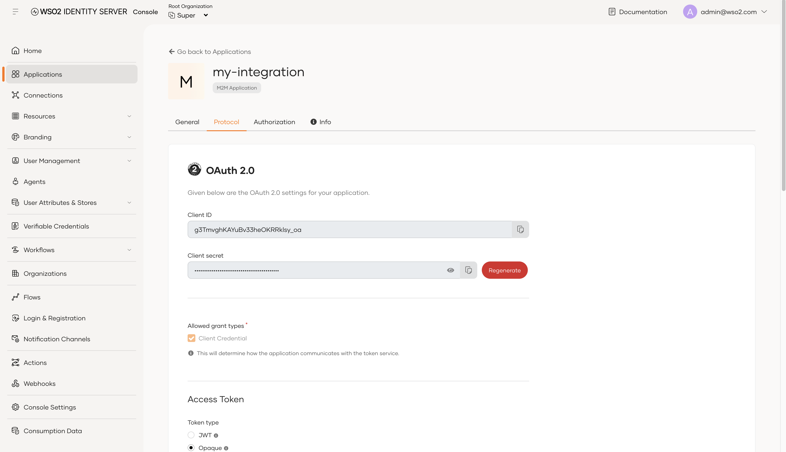
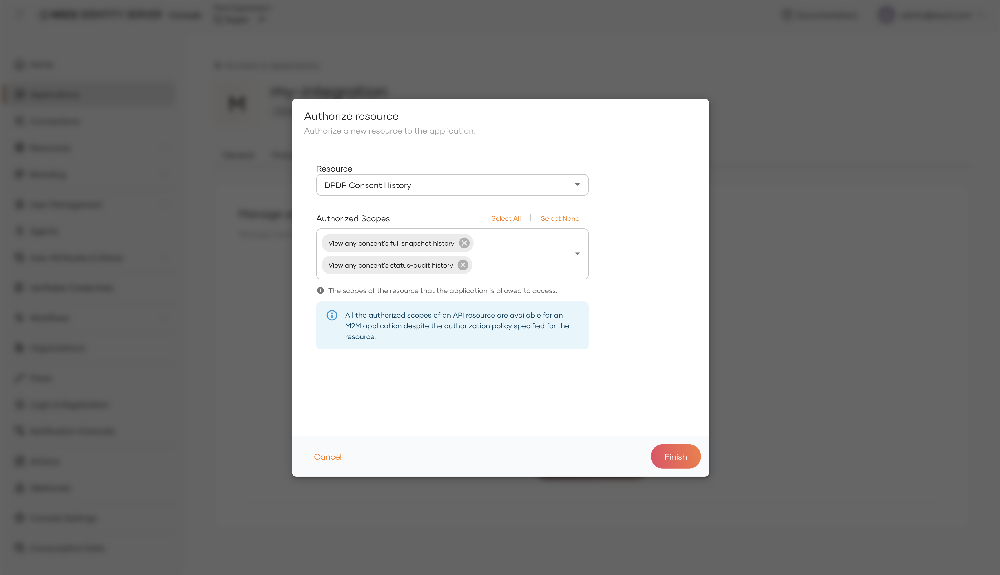
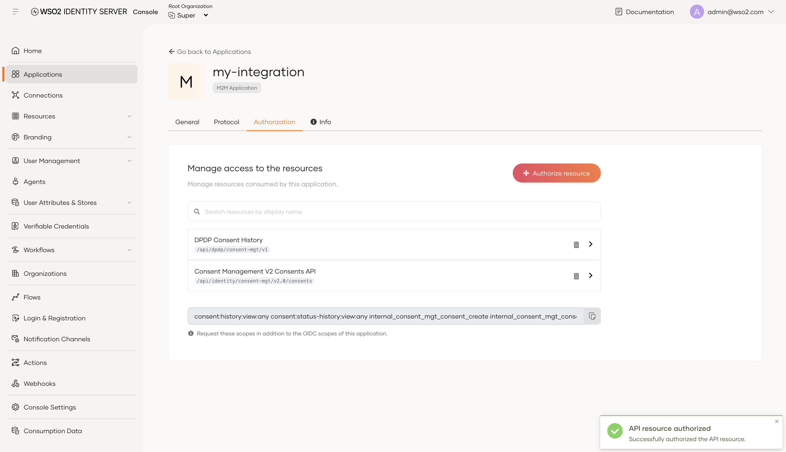

import Tabs from '@theme/Tabs';
import TabItem from '@theme/TabItem';

# Managing Access

The DPDP Accelerator provides two ways to access its capabilities:

1. **Access to the Consent Portal** — control what users can do when they sign in to the Consent Portal.
2. **Direct API access** — allow applications and backend systems to call the accelerator APIs directly using an access token.

If you are setting up access for people who use the Consent Portal, start with **[Part 1: Managing access to the Consent Portal](#part-1-managing-access-to-the-consent-portal)**.

If you are integrating the accelerator with another application or testing its APIs using curl or Postman, go to **[Part 2: Managing access to the APIs directly](#part-2-managing-access-to-the-apis-directly)**.

---

## Part 1: Managing access to the Consent Portal

The DPDP Accelerator includes the Consent Portal, which is used by different types of users. Since the same portal is used for different purposes, each user is assigned a role that determines what they can access and manage.

### Understand the built-in roles

The DPDP Accelerator comes with three predefined roles. Each role includes a set of permissions that defines what the user can do in the Consent Portal.

| Role                     | Intended for                                          | What they can do                                                               |
| :------------------------- |:------------------------------------------------------|:-------------------------------------------------------------------------------|
| `dpdp-consent-user`  | Data principal                                        | Manage their own consents, view history and track their own complaints etc.    |
| `dpdp-consent-admin` | Data fiduciary administrators                        | Manage all consents, purposes and data elements and manage event notifications |
| `dpdp-consent-dpo`   | Data Protection Officers and complaint-handling staff | View and manage complaints across the organization.                            |

### Understanding roles and scopes

Roles provide a convenient way to group permissions, while **scopes** are what the system actually checks when a user performs an action.

For example, the **Consent Admin** role has a broader set of scopes because administrators need access to more functionality. The **Consent User** role has only the scopes required for users to manage their own data and complaints.

You can also create custom roles when the built-in roles do not match your organization's requirements. Assign only the scopes required for each role.

:::tip
Haven't created your users yet? Follow [Configuring Users and Roles](../install-and-setup/configuring-users-and-roles.md) to create users and assign these roles before continuing.
:::

### Scope reference

The following sections provide the technical mapping between API operations, required scopes, and the built-in roles.

You normally do not need to work with these scope names when assigning the predefined roles. They are mainly useful when you are creating custom roles, configuring an API integration, or troubleshooting an authorization error.

### Consent management

| Operation                            | Required scope(s)                                                                                                    | Admin | Data principal | DPO |
| :-------------------------------------- | :------------------------------------------------------------------------------------------------------------------- | :-----: | :----: | :---: |
| Sign in and manage own consents      | `internal_login`                                                                                                     |   <span className="scope-yes">✓</span>   |   <span className="scope-yes">✓</span>  |  <span className="scope-yes">✓</span>  |
| View or manage other users' consents | `internal_consent_mgt_consent_view`, `internal_consent_mgt_consent_create`, `internal_consent_mgt_consent_update`   |   <span className="scope-yes">✓</span>   |  <span className="scope-no">✗</span>   |  <span className="scope-no">✗</span>  |
| View purposes                        | `internal_consent_mgt_purpose_view`                                                                                  |   <span className="scope-yes">✓</span>   |  <span className="scope-no">✗</span>   |  <span className="scope-no">✗</span>  |
| Create, update, or delete purposes   | `internal_consent_mgt_purpose_create`, `internal_consent_mgt_purpose_update`, `internal_consent_mgt_purpose_delete` |   <span className="scope-yes">✓</span>   |  <span className="scope-no">✗</span>   |  <span className="scope-no">✗</span>  |
| View data elements                   | `internal_consent_mgt_element_view`                                                                                  |   <span className="scope-yes">✓</span>   |  <span className="scope-no">✗</span>   |  <span className="scope-no">✗</span>  |
| Create or delete data elements       | `internal_consent_mgt_element_create`, `internal_consent_mgt_element_delete`                                        |   <span className="scope-yes">✓</span>   |  <span className="scope-no">✗</span>   |  <span className="scope-no">✗</span>  |

### Consent history

| Operation                                    | Required scope                     | Admin | Data principal | DPO |
| :---------------------------------------------- | :------------------------------------ | :-----: | :----: | :---: |
| View own status-audit history                | `consent:status-history:view:self` |   <span className="scope-yes">✓</span>   |   <span className="scope-yes">✓</span>  |  <span className="scope-no">✗</span>  |
| View own full snapshot history               | `consent:history:view:self`        |   <span className="scope-yes">✓</span>   |   <span className="scope-yes">✓</span>  |  <span className="scope-no">✗</span>  |
| View organization-wide status-audit history  | `consent:status-history:view:any`  |   <span className="scope-yes">✓</span>   |  <span className="scope-no">✗</span>   |  <span className="scope-no">✗</span>  |
| View organization-wide full snapshot history | `consent:history:view:any`         |   <span className="scope-yes">✓</span>   |  <span className="scope-no">✗</span>   |  <span className="scope-no">✗</span>  |

### Complaints

| Operation                                            | Required scope(s)                                | Admin | Data principal | DPO |
| :------------------------------------------------------ | :-------------------------------------------------- |:-----:| :----: | :---: |
| Create, view, reply to, or transition own complaints | `complaints:read:self`, `complaints:write:self` |  <span className="scope-no">✗</span>    |   <span className="scope-yes">✓</span>  |  <span className="scope-no">✗</span>  |
| View or manage any complaint in the organization     | `complaints:read:any`, `complaints:write:any`   |  <span className="scope-no">✗</span>    |  <span className="scope-no">✗</span>   |  <span className="scope-yes">✓</span>  |

### Event notifications

| Operation                                | Required scope                             | Admin | Data principal | DPO |
| :------------------------------------------ | :-------------------------------------------- | :-----: | :----: | :---: |
| View topics                             | `notifications:topics:read`               |   <span className="scope-yes">✓</span>   |  <span className="scope-no">✗</span>   |  <span className="scope-no">✗</span>  |
| Create or deregister topics             | `notifications:topics:write`              |   <span className="scope-yes">✓</span>   |  <span className="scope-no">✗</span>   |  <span className="scope-no">✗</span>  |
| View subscriptions and delivery history | `notifications:subscriptions:read`        |   <span className="scope-yes">✓</span>   |  <span className="scope-no">✗</span>   |  <span className="scope-no">✗</span>  |
| Create, verify, or delete subscriptions | `notifications:subscriptions:write`       |   <span className="scope-yes">✓</span>   |  <span className="scope-no">✗</span>   |  <span className="scope-no">✗</span>  |
| View events and delivery history        | `notifications:events:read`               |   <span className="scope-yes">✓</span>   |  <span className="scope-no">✗</span>   |  <span className="scope-no">✗</span>  |
| Publish events                          | `notifications:events:write`              |   <span className="scope-yes">✓</span>   |  <span className="scope-no">✗</span>   |  <span className="scope-no">✗</span>  |
| Poll event deliveries                   | `notifications:events:poll`               |  <span className="scope-no">✗</span>    |  <span className="scope-no">✗</span>   |  <span className="scope-no">✗</span>  |
| Submit delivery-completion evidence     | `notifications:event-deliveries:complete` |  <span className="scope-no">✗</span>    |  <span className="scope-no">✗</span>   |  <span className="scope-no">✗</span>  |

The last two scopes are intended for applications that receive events. For example, you can create dedicated applications with only the permissions they require:

| Integration       | Scopes to assign                                                        |
| :------------------- | :-------------------------------------------------------------------------- |
| `event-publisher` | `notifications:events:write`                                           |
| `event-receiver`  | `notifications:events:poll`, `notifications:event-deliveries:complete` |

---

## Part 2: Managing access to the APIs directly

The roles described above control access for users of the Consent Portal.

For system-to-system integrations, you can use a **machine-to-machine application** to access the accelerator APIs. 
This is useful for testing APIs with curl or Postman, integrating the accelerator with another system, or running backend services that call the APIs.

### Step 1: Create an application

1. Sign in to the Identity Server Console:

   <Tabs groupId="tenant-type">
   <TabItem value="super" label="Super tenant" default>

   ```text
   https://<host>:9443/console
   ```

   </TabItem>
   <TabItem value="tenant" label="Tenant">

   ```text
   https://<host>:9443/t/<tenant>/console
   ```

   </TabItem>
   </Tabs>

2. Select **Applications** from the left navigation.
3. Click **New Application**.
4. Select **Machine-to-Machine Application**.

   This application type is intended for backend services and scripts that need to access APIs without an interactive user login.

   

5. Enter a name for the application, such as `my-integration`, and click **Create**.
6. Open the **Protocol** tab and note the **Client ID** and **Client Secret**. You will use these credentials to obtain an access token.

   

> **Keep the client secret secure.** Do not commit it to source control or expose it in client-side applications.

### Step 2: Authorize the required scopes

After creating the application, authorize the scopes required by the APIs you want to call.

1. Open the application's **API Authorization** tab.
2. Click **Authorize an API**.
3. Select the API you want to access, such as DPDP Consent History, Complaints, or Event Notification.
4. Select the scopes required by your integration.

   

   

Only authorize the permissions the application actually needs. For example, an application that only publishes events should not be given complaint-management or consent-management permissions.

Refer to the scope tables above to identify the scopes required for each operation.

### Step 3: Get an access token

Use the **client ID** and **client secret** of your machine-to-machine application to request an access token using the OAuth 2.0 `client_credentials` grant.

```bash
curl -X POST "https://<HOST>/t/<TENANT_DOMAIN>/oauth2/token" \
  -H "Content-Type: application/x-www-form-urlencoded" \
  -d "grant_type=client_credentials" \
  -d "client_id=<CLIENT_ID>" \
  -d "client_secret=<CLIENT_SECRET>" \
  -d "scope=internal_consent_mgt_consent_view"
```

Replace the following placeholders with values from your environment:

* `<HOST>` — the hostname of your Identity Server
* `<TENANT_DOMAIN>` — your tenant domain.
* `<CLIENT_ID>` — the client ID of your machine-to-machine application
* `<CLIENT_SECRET>` — the client secret of your machine-to-machine application

Replace `internal_consent_mgt_consent_view` with the scopes authorized for your application. For multiple scopes, separate them with spaces.

:::note Local testing with a self-signed certificate
Add `-k` to the `curl` command above if your local Identity Server uses the
default self-signed certificate. Never use `-k` in production — configure a
trusted CA certificate, or pass it explicitly with `--cacert` instead.
:::

### Step 4: Call the API

Once you have the access token, include it as a Bearer token in the API request. For example, fetching all consents in the tenant:

```bash
curl "https://<HOST>/t/<TENANT_DOMAIN>/api/identity/consent-mgt/v2.0/consents" \
  -H "Authorization: Bearer <ACCESS_TOKEN>"
```

Replace `<ACCESS_TOKEN>` with the `access_token` value from the response in Step 3, and `<TENANT_DOMAIN>` with your tenant domain.

The API validates the access token and checks whether it contains the scope required for the requested operation.

### Troubleshooting authorization errors

If the request fails, check the HTTP status code:

- **401 Unauthorized** — The access token is missing, invalid, or expired. Obtain a new access token and try again.
- **403 Forbidden** — The access token is valid, but it does not contain the scope required by the API. Return to Step 2 and authorize the required scope for the application.

## Next Steps

- [Try Out: Consent](../try-out/consent.md) — see the scopes and tokens from this page used in a real API call.
- [Consent](consent.md) — learn how consent is given, reviewed, and revoked.
- [Role Guide](../role-guide.md) — the full reference for roles, scopes, and permissions.
