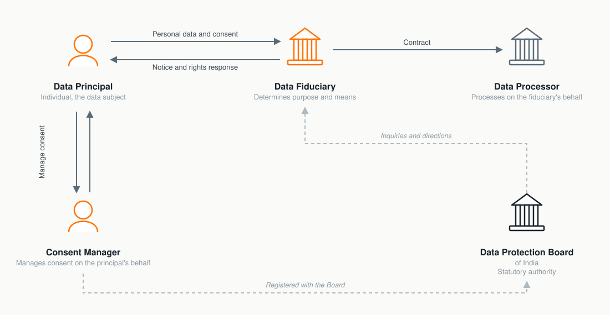
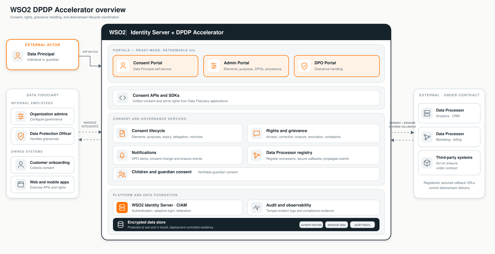

# Digital Personal Data Protection and the WSO2 DPDP Accelerator

India's [Digital Personal Data Protection Act, 2023](https://www.indiacode.nic.in/indiacode/handle/123456789/22037)
(DPDP Act) establishes a framework for processing digital personal data that
recognises both an individual's right to protect personal data and the need to
process it for lawful purposes. The WSO2 DPDP Accelerator extends WSO2
Identity Server with consent, complaint (grievance), audit, and event-notification
capabilities that help an organization put parts of that framework into
operation.

> Disclaimer: This page is a product introduction, not legal advice or a statement of
> compliance. An organization remains responsible for determining how the Act,
> its commencement notifications, and applicable rules affect its processing
> activities.

## What is the DPDP Act?

The DPDP Act applies to digital personal data processed in India, including
data collected in non-digital form and digitised later. It can also apply to
processing outside India when that processing is connected with offering
goods or services to Data Principals in India. The Act excludes specified
personal or domestic processing and certain personal data made publicly
available by the Data Principal or by a person legally required to publish it.

The framework is built around several practical ideas:

- Process personal data for a lawful purpose, using consent or another use
  permitted by the Act.
- Give a clear notice and obtain consent that is free, specific, informed,
  unconditional, unambiguous, and expressed through clear affirmative action
  when consent is the basis for processing.
- Make withdrawing consent as easy as giving it and communicate the resulting
  change to the processors acting for the Data Fiduciary.
- Keep personal data accurate where it is used to make decisions or disclosed
  to another Data Fiduciary, apply reasonable security safeguards, and respond
  to personal-data breaches.
- Provide ways for Data Principals to exercise their rights and raise
  grievances.

The Act gives Data Principals rights to obtain specified information about
processing, seek correction, completion, updating, or erasure, use grievance
redressal, and nominate another individual to exercise their rights in the
event of death or incapacity. It also places duties on Data Principals, such as
not impersonating another person or submitting a false or frivolous grievance.
The precise conditions and exceptions in the Act still apply to every right
and obligation.

The Central Government brought the Act into force in phases through a
[13 November 2025 commencement notification](https://www.meity.gov.in/static/uploads/2025/11/c56ceae6c383460ca69577428d36828b.pdf).
Always consult the current notifications and rules before setting a compliance
timeline.

## Participants in the DPDP ecosystem

| Participant | Role under the Act |
|---|---|
| **Data Principal** | The individual to whom the personal data relates. The definition includes a parent or lawful guardian acting for a child, and a lawful guardian acting for a person with disability. |
| **Data Fiduciary** | Determines the purpose and means of processing, alone or with others, and remains responsible for processing performed on its behalf. |
| **Data Processor** | Processes personal data on behalf of a Data Fiduciary. A Data Fiduciary may engage a processor under a valid contract. |
| **Consent Manager** | A person registered with the Data Protection Board of India that provides an accessible, transparent, and interoperable platform through which a Data Principal can give, manage, review, and withdraw consent. |
| **Significant Data Fiduciary** | A Data Fiduciary notified by the Central Government based on factors in the Act and subject to additional obligations. |
| **Data Protection Board of India** | The statutory body established under the Act to perform the functions assigned to it, including handling personal-data-breach intimations and complaints. |

The accelerator helps a Data Fiduciary provide consent-management experiences.
Installing it does **not** register the organization or the product as a
statutory Consent Manager.

## A sample digital-consent journey

Consider an online service that needs an individual's contact details to
deliver an order and separately wants permission to send marketing messages.
A DPDP-oriented implementation can work as follows:

1. The service describes each purpose and the personal-data elements it needs.
2. The individual reviews the notice and takes an affirmative action for the
   optional purpose.
3. The service records the consent and permits processing only for the selected
   purpose and data elements.
4. The individual later reviews the consent, changes it, or withdraws it.
5. The consent change is recorded and relevant downstream systems are
   notified so that they can apply the new state.
6. If the individual has a concern, they use the organization's grievance
   process and can track the response.

Consent is not the only basis for processing under the Act. The Data Fiduciary
must determine whether consent or one of the Act's certain legitimate uses
applies to each processing activity.

## How the WSO2 DPDP Accelerator helps

The accelerator runs with WSO2 Identity Server and provides a tenant-aware
Consent Portal plus supporting services.

| Operational need | Accelerator capability |
|---|---|
| Define why data is requested | A purpose and data-element catalog lets administrators model the information presented in consent experiences. |
| Capture and manage consent | Data Principals can view and manage their own consents, while authorized administrators can manage tenant-wide consent records. |
| Demonstrate consent history | Status audit and snapshot history preserve the recorded evolution of a consent for authorized review. |
| Provide a grievance channel | Data Principals can submit and track complaints; DPO and administrator views support assignment, messages, attachments, status changes, and due-date tracking. |
| Propagate lifecycle changes | Event Notification records consent and user lifecycle events and supports webhook or polling subscriptions for downstream consumers. |
| Separate responsibilities | Tenant roles distinguish personal history and complaint self-service, complaint handling, and broader portal administration. Dedicated integration roles can be created with narrower scopes. |
| Support accessible notices | The portal interface supports English and the languages listed in the Eighth Schedule to the Constitution; catalog content can be localized separately. |
| Support account lifecycle actions | An authorized user can request self-service account deletion, and a lifecycle event can notify configured receivers. |

The accelerator can notify connected systems when one of five important
consent or user lifecycle changes occurs:

| What happened | Topic identifier | Why a connected system may care |
|---|---|---|
| A consent was updated, approved, or rejected | `consent.update` | Keep consent decisions and permitted processing activities in sync. |
| A consent or authorization was withdrawn | `consent.revoke` | Stop or reassess processing that depended on the withdrawn consent. |
| A consent reached its configured expiry | `consent.expire` | Stop or reassess processing after the consent is no longer active. |
| Information in a user's profile changed | `user.data.change` | Review downstream copies or workflows that depend on the changed profile data. |
| A user account was deleted | `user.account.delete` | Start the appropriate downstream deletion, retention, or audit process. |

The topic identifier is the stable technical name used when creating a
subscription. The plain-language description explains the real-world change
represented by events published to that topic.

Creating these topics does not create an event. When lifecycle publication is
enabled, the corresponding consent or user action publishes the event. A
subscription is needed only to deliver or poll that event, not to create the
event record.

## What the accelerator does not decide

The accelerator supplies technical building blocks; it does not replace the
organization's legal, governance, or data-management programme. In particular,
it does not:

- determine the lawful purpose or legal basis for a processing activity;
- discover or classify personal data across enterprise systems;
- register an organization as a Consent Manager or Significant Data
  Fiduciary;
- make downstream processors stop processing merely because they received an
  event; each receiving system must enforce the change;
- decide whether legal retention requirements override an erasure request; or
- automatically purge every DPDP record when an Identity Server account is
  deleted.

Organizations should combine these capabilities with policies, processor
contracts, security controls, retention and erasure procedures, breach
response, and legal review.

## Start using the accelerator

1. Follow the [Quickstart](quickstart.md) for a local quick setting up of the solution
   tenant.
2. Run the [Tryout Flows](tryout-flows.md) to exercise the shipped catalog,
   consent, complaint, Event Notification, and account lifecycle capabilities.
3. Use the [Setup Guide](setup-guide.md) to install the accelerator and prepare
   its databases.
4. Review the [Configuration Guide](configuration-guide.md) before a production
   deployment.
5. Assign portal and integration permissions with the
   [Role Management Guide](role-guide.md).
6. Configure lifecycle delivery with the
   [Event Notification Guide](event-notification-guide.md).
7. Adapt the user interface and catalog content with the
   [Localization Guide](localization-guide.md).

## Official references

- [The Digital Personal Data Protection Act, 2023 — India Code](https://www.indiacode.nic.in/indiacode/handle/123456789/22037)
- [DPDP Act commencement notification, 13 November 2025 — Ministry of Electronics and Information Technology](https://www.meity.gov.in/static/uploads/2025/11/c56ceae6c383460ca69577428d36828b.pdf)
