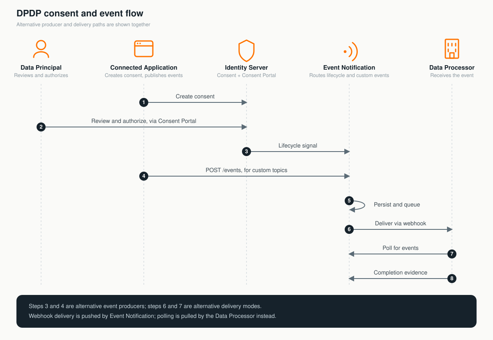
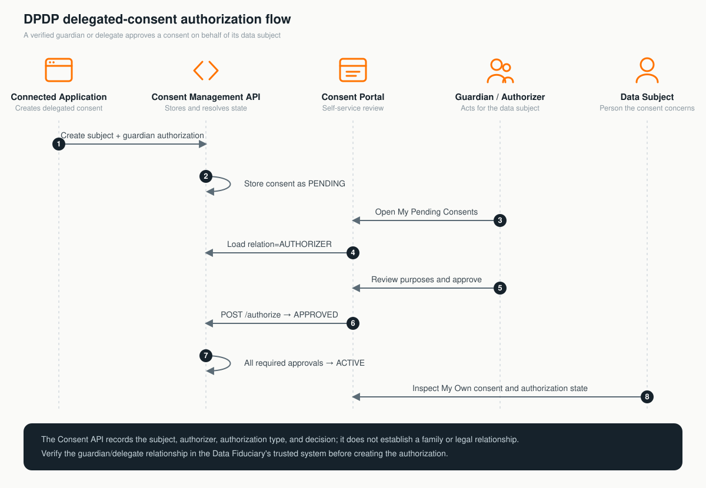
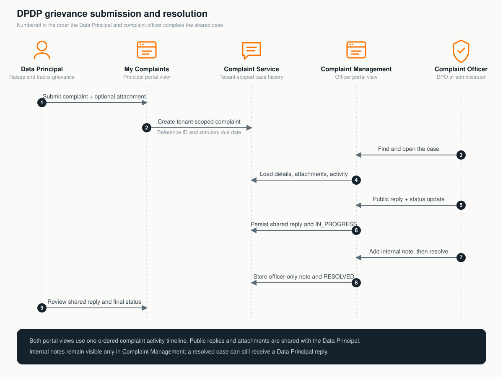

# Try out the WSO2 DPDP Accelerator

Use these flows after completing the [Quickstart](quickstart.md). They exercise
the capabilities shipped in this repository through the Consent Portal and
WSO2 Identity Server. They do not require a separate demonstration
application.

## Before you begin

Prepare an ordinary tenant such as `example.com` and four disposable test
users:

| Test user | Role | Used for |
|---|---|---|
| Portal administrator | `dpdp-consent-admin` | Catalog, tenant-wide consent, subscription, event, and complaint administration |
| Data Principal | `dpdp-consent-user` | Personal consent history, complaints, and optional account deletion |
| Guardian or delegated authorizer | None required for basic consent self-service | Reviewing and authorizing a consent created for another Data Principal |
| Complaint officer | `dpdp-consent-dpo` | Tenant-wide complaint handling without full portal administration |

Role membership is not assigned automatically. Assign each role in the tenant
Console, then sign out and sign in again so the new token contains the relevant
scopes. See the [Role Management Guide](role-guide.md) for the complete access
model.

Open the portal for the tenant:

```text
https://<host>:9443/t/example.com/consent-portal/
```

The examples below use disposable names. If a previous run created the same
catalog item or subscription, use a new name or remove the earlier test data
where the portal permits it.



The guide is divided into the accelerator's three main feature areas. It keeps
the walkthrough focused on the major user journeys and links to the detailed
guides for advanced configuration and integration operations.

| Feature area | Major capabilities exercised | Where to perform them |
|---|---|---|
| Consent management | Define catalog data, review and authorize direct or delegated consent, inspect history, and revoke consent | Consent Portal; a connected application or API must create the initial consent |
| Event Notifications | Inspect topics, register a subscription, trigger an automatic event, and inspect its delivery | Consent Portal and tenant Console; receiver processing is performed by the webhook or poll client |
| Grievance management | Submit a complaint, exchange messages, add attachments, manage status, and resolve the case | Consent Portal |

### API example conventions

The examples include both API calls made by the portal and calls made directly
by publisher or receiver clients. They let you inspect the exact request and
response while following the related operation. Set these values before trying
a command directly:

```bash
export BASE_URL="https://localhost:9443"
export TENANT_DOMAIN="example.com"
export ACCESS_TOKEN="<access-token-with-the-required-scopes>"
```

The UUIDs and epoch timestamps in responses are representative. Identity
Server generates the actual values. All requests are tenant-qualified through
the access token and the `/t/${TENANT_DOMAIN}` URL; do not reuse a token issued
for another tenant.

## Consent management

The Consent Portal supports catalog administration, self-service consent
review, authorization and revocation, tenant-wide administrative review, and
consent history. It deliberately does not create consents: a connected
application or the Consent Management API creates the consent before the Data
Principal acts on it.

### Flow 1: Define a purpose and its data element

This flow shows how a Data Fiduciary can model why personal data is requested
and which data element is involved.

**Portal:** Sign in as the portal administrator and use **Elements** and
**Purposes**. The API examples show the requests made for the same operations.

#### Create an element

1. Sign in as the portal administrator.
2. Open **Elements** and select **Add Element**.
3. Enter:

   | Field | Example |
   |---|---|
   | Name | `contact-email` |
   | Display name | `Contact email` |
   | Description | `Email address used to send optional product updates.` |

4. Select **Create**.
5. Open the resulting row and confirm its identifier, display name,
   description, and properties.

The equivalent request is:

```bash
curl -k -X POST \
  "${BASE_URL}/t/${TENANT_DOMAIN}/api/identity/consent-mgt/v2.0/elements" \
  -H "Authorization: Bearer ${ACCESS_TOKEN}" \
  -H "Content-Type: application/json" \
  -d '{
    "name": "contact-email",
    "displayName": "Contact email",
    "description": "Email address used to send optional product updates."
  }'
```

Representative response:

```json
{
  "id": "b9dd5f0d-4981-4d56-86b6-65b5d8d32e24",
  "name": "contact-email",
  "displayName": "Contact email",
  "description": "Email address used to send optional product updates."
}
```

#### Create a purpose

1. Open **Purposes** and select **Add Purpose**.
2. Enter:

   | Field | Example |
   |---|---|
   | Name | `marketing-email` |
   | Type | `optional-marketing` |
   | Version | `1.0` |
   | Description | `Send occasional product news by email.` |

3. In the element selector, add `contact-email` and choose whether it is
   mandatory for this purpose.
4. Select **Create**.
5. Open the purpose and verify that version `1.0` references the expected
   element.

Replace `<element-id>` with the `id` returned above. The equivalent request is:

```bash
curl -k -X POST \
  "${BASE_URL}/t/${TENANT_DOMAIN}/api/identity/consent-mgt/v2.0/purposes" \
  -H "Authorization: Bearer ${ACCESS_TOKEN}" \
  -H "Content-Type: application/json" \
  -d '{
    "name": "marketing-email",
    "type": "optional-marketing",
    "version": "1.0",
    "description": "Send occasional product news by email.",
    "elements": [
      {
        "id": "<element-id>",
        "mandatory": false
      }
    ]
  }'
```

Representative response:

```json
{
  "id": "d223f77a-54ed-4099-99b2-9900795483ae",
  "name": "marketing-email",
  "description": "Send occasional product news by email.",
  "type": "optional-marketing",
  "latestVersion": {
    "id": "787c0c69-7a84-4a62-b5f1-3706ce818d72",
    "version": "1.0"
  },
  "elements": [
    {
      "id": "<element-id>",
      "name": "contact-email",
      "displayName": "Contact email",
      "mandatory": false
    }
  ]
}
```

Expected result: the purpose and element appear in the tenant's catalog and
can be used by a connected application when it creates a consent.

> The portal does not contain an **Add Consent** action. A consent is created
> by an application through WSO2 Identity Server's Consent Management v2 API
> or as part of its consent journey. The automatically provisioned **DPDP
> Consent API Invoker** application supports machine-to-machine access to the
> consents resource; see
> [Consent API Invoker provisioning](configuration-guide.md#consent-api-invoker-provisioning).

### Flow 2: Review, authorize, revoke, and audit a consent

This flow requires a consent created for the Data Principal by a connected
application or the Consent Management v2 API. Use a disposable consent because
approval, rejection, and revocation change its state.

**Portal:** The Data Principal performs the self-service actions under
**Pending Consents** and **All Consents**. The administrator uses
**Administration → Consents**. Creating the prerequisite consent is not a
portal operation.

#### Act as the Data Principal

1. Sign in as the Data Principal.
2. Open **Pending Consents**.
3. If the user's authorization is pending, open the consent and select
   **Approve** or **Reject**. The available action depends on the consent and
   authorization state.
4. Open **All Consents** and select a consent.
5. Review its metadata, properties, purposes, data elements, and
   authorizations.
6. In **Consent Lifecycle**, confirm that the status timeline records the
   action, actor, date, and time.
7. Select **View Full History** to inspect the stored snapshots when snapshot
   history is enabled.
8. For an active consent that is safe to alter, select **Revoke** and confirm
   the action.

To inspect the same consent directly, use the Data Principal's access token:

```bash
curl -k \
  "${BASE_URL}/t/${TENANT_DOMAIN}/api/users/v1/me/consents/<consent-id>" \
  -H "Authorization: Bearer ${ACCESS_TOKEN}"
```

Representative response:

```json
{
  "id": "81c6dcb8-3df9-4b15-a43e-50f253792dbe",
  "subjectId": "portal-user",
  "serviceId": "insurance-portal",
  "state": "PENDING",
  "language": "en",
  "timestamp": 1788230400000,
  "expiryTime": 1790908800000,
  "purposes": [
    {
      "id": "d223f77a-54ed-4099-99b2-9900795483ae",
      "name": "marketing-email",
      "type": "optional-marketing",
      "versionId": "787c0c69-7a84-4a62-b5f1-3706ce818d72",
      "version": "1.0",
      "elements": [
        {
          "id": "b9dd5f0d-4981-4d56-86b6-65b5d8d32e24",
          "name": "contact-email",
          "displayName": "Contact email"
        }
      ]
    }
  ],
  "authorizations": [
    {
      "userId": "portal-user",
      "state": "PENDING",
      "updatedTime": 1788230400000
    }
  ],
  "properties": {}
}
```

Approve the consent by sending the state in the request body:

```bash
curl -k -X POST \
  "${BASE_URL}/t/${TENANT_DOMAIN}/api/users/v1/me/consents/<consent-id>/authorize" \
  -H "Authorization: Bearer ${ACCESS_TOKEN}" \
  -H "Content-Type: application/json" \
  -d '{ "state": "APPROVED" }'
```

Use `REJECTED` instead of `APPROVED` to reject it. A successful authorization
has no required JSON response body; the portal fetches the consent again to
display its new state. Revocation also has no request or response body:

```bash
curl -k -X POST \
  "${BASE_URL}/t/${TENANT_DOMAIN}/api/users/v1/me/consents/<consent-id>/revoke" \
  -H "Authorization: Bearer ${ACCESS_TOKEN}"
```

Expected result: the consent shows its new state, and the lifecycle section
contains the corresponding audit entry. With lifecycle event publication
enabled, an approval or rejection can publish `consent.update`, while a
supported revocation lifecycle path publishes `consent.revoke`.

#### Inspect the same consent as an administrator

1. Sign in as the portal administrator.
2. Open **Administration → Consents**.
3. Filter by consent ID, user, state, service, purpose, or the available
   advanced filters.
4. Open the consent and compare the tenant-wide administrative view with the
   Data Principal's view.

The self-service view only returns consents involving the signed-in user. The
administrative registry is tenant-wide and requires the administrative consent
scopes.

To verify the lifecycle audit independently of the UI:

```bash
curl -k \
  "${BASE_URL}/t/${TENANT_DOMAIN}/api/dpdp/consent-mgt/v1/consents/<consent-id>/status-history?limit=100&offset=0" \
  -H "Authorization: Bearer ${ACCESS_TOKEN}"
```

Representative response after approval:

```json
{
  "consentId": "81c6dcb8-3df9-4b15-a43e-50f253792dbe",
  "statusHistory": [
    {
      "previousStatus": "PENDING",
      "currentStatus": "ACTIVE",
      "actionType": "AUTHORIZE_APPROVE",
      "actionBy": "portal-user",
      "actionTime": 1788230520000
    }
  ],
  "pagination": {
    "limit": 100,
    "offset": 0,
    "totalCount": 1
  }
}
```

### Flow 3: Authorize consent as a guardian or delegate

This flow demonstrates the parent-managed child-account pattern described in
the DPDP solution design. The Consent Management API stores a data subject and
one or more separate authorizers. It does not establish that a person is
actually a parent, lawful guardian, or other representative. A trusted Data
Fiduciary system must verify that relationship before creating the delegated
authorization.



**Portal:** The guardian or delegate uses **My Pending Consents** and can filter
**My Consents** by **Managed by Me**. The data subject can filter the same page
by **My Own**. A connected application creates the prerequisite consent using
the Consent Management API.

#### Create a delegated consent

1. Create a disposable data-subject user and a separate guardian or delegated
   authorizer in the same tenant.
2. Verify their relationship in the trusted system used for this test. The
   Consent Management API does not perform this verification.
3. Obtain a client-credentials token for the automatically provisioned **DPDP
   Consent API Invoker** application.
4. Use the purpose and element identifiers from Flow 1 to create a consent
   whose root `subjectId` is the data subject and whose `authorizations` list
   contains the guardian.
5. Retain the returned consent ID.

Set `ACCESS_TOKEN` to the Consent API Invoker's client-credentials token for
this request. Replace the placeholder usernames with the tenant-qualified
usernames expected by your Identity Server deployment:

```bash
curl -k -X POST \
  "${BASE_URL}/t/${TENANT_DOMAIN}/api/identity/consent-mgt/v2.0/consents" \
  -H "Authorization: Bearer ${ACCESS_TOKEN}" \
  -H "Content-Type: application/json" \
  -d '{
    "subjectId": "<data-subject-username>",
    "serviceId": "education-portal",
    "language": "en",
    "purposes": [
      {
        "id": "<purpose-id>",
        "elements": [
          {
            "id": "<element-id>"
          }
        ]
      }
    ],
    "authorizations": [
      {
        "userId": "<guardian-username>",
        "type": "guardian"
      }
    ],
    "properties": {
      "scenario": "parent-managed-child-account"
    }
  }'
```

Do not send the data subject as another authorization entry. `subjectId`
already identifies the person whose data the consent concerns; the
`authorizations` array contains the other users who must decide on that
person's behalf. When at least one authorization is supplied, Identity Server
stores the new consent as `PENDING` even if the request omits `state` or sends
the normal `ACTIVE` default.

#### Approve as the guardian or delegate

1. Sign in as the guardian or delegated authorizer.
2. Open **My Pending Consents**. Alternatively, open **My Consents**, choose
   **Managed by Me**, and filter by `PENDING`.
3. Open the delegated consent and confirm the data subject, service, purposes,
   elements, and authorization entry.
4. Select **Approve** and confirm the action.
5. Reopen the consent and confirm that the guardian's authorization is
   `APPROVED`. With this single required authorizer, the aggregate consent is
   now `ACTIVE`. If several authorizers were supplied, it remains `PENDING`
   until every required authorizer approves.

The guardian can inspect the pending consent directly before approving it.
Set `ACCESS_TOKEN` to that user's portal access token:

```bash
curl -k \
  "${BASE_URL}/t/${TENANT_DOMAIN}/api/users/v1/me/consents?state=PENDING&relation=AUTHORIZER&attributes=purposes,authorizations" \
  -H "Authorization: Bearer ${ACCESS_TOKEN}"
```

Approve the consent with the guardian's token:

```bash
curl -k -X POST \
  "${BASE_URL}/t/${TENANT_DOMAIN}/api/users/v1/me/consents/<consent-id>/authorize" \
  -H "Authorization: Bearer ${ACCESS_TOKEN}" \
  -H "Content-Type: application/json" \
  -d '{ "state": "APPROVED" }'
```

A successful authorization has no required response body. Fetch the consent
again to verify the authorization and aggregate consent states.

#### Verify as the data subject

1. Sign out and sign in as the data subject.
2. Open **My Consents** and choose **My Own**.
3. Open the consent and verify that it is `ACTIVE` and records the guardian's
   approved authorization.
4. Inspect **Consent Lifecycle** and **View Full History** to confirm that the
   authorization and aggregate state transition were audited.

The equivalent subject-scoped query is:

```bash
curl -k \
  "${BASE_URL}/t/${TENANT_DOMAIN}/api/users/v1/me/consents?relation=SUBJECT&attributes=purposes,authorizations" \
  -H "Authorization: Bearer ${ACCESS_TOKEN}"
```

Expected result: the data subject and guardian see the same consent through
different relationships. Only the listed guardian can record that delegated
authorization decision, and the consent becomes usable only after all required
authorizers approve. Relationship validation and downstream enforcement remain
the Data Fiduciary's responsibility; this flow proves storage, authorization,
state resolution, and audit behavior in the accelerator.

## Grievance management

The portal provides separate views for a Data Principal and a complaint
officer. The same case is used to demonstrate submission, attachments, public
and internal communication, status transitions, statutory due dates, and
resolution without requiring a separate client application.



### Flow 4: Submit and resolve a complaint

This flow demonstrates a grievance conversation between a Data Principal and a
complaint officer, including a Data Principal follow-up reply.

**Portal:** The Data Principal uses **My Complaints**. A user holding
`dpdp-consent-dpo` or `dpdp-consent-admin` uses **Complaint Management**. The
API samples mirror the two portal views.

#### Submit the complaint

1. Sign in as the Data Principal.
2. Open **My Complaints** and select **Submit New Complaint**.
3. Choose a category and enter a description that does not include unnecessary
   personal data.
4. Optionally attach one supported PDF, DOCX, PNG, or JPEG file within the
   configured size limit.
5. Submit the complaint and retain the generated reference ID.
6. Open the complaint to inspect its status, statutory due date, shared
   activity, and attachments.

The portal derives the complainant from the access token. Do not send a
`userId` in this self-service request:

```bash
curl -k -X POST \
  "${BASE_URL}/t/${TENANT_DOMAIN}/api/dpdp/complaints/v1/me/complaints" \
  -H "Authorization: Bearer ${ACCESS_TOKEN}" \
  -H "Content-Type: application/json" \
  -d '{
    "subjectCategory": "DATA_ACCESS_DENIED",
    "description": "I cannot obtain the information associated with my consent."
  }'
```

Representative `201 Created` response:

```json
{
  "id": "fbda5af9-f01b-47c1-8cd6-0268e6562614",
  "referenceId": "CMP-2026-00001",
  "subjectCategory": "DATA_ACCESS_DENIED",
  "priority": "HIGH",
  "status": "OPEN",
  "userId": "portal-user",
  "description": "I cannot obtain the information associated with my consent.",
  "submittedAt": 1788231000000,
  "updatedAt": 1788231000000,
  "statutoryDueDate": 1790823000000
}
```

#### Handle the complaint

1. Sign in as the complaint officer.
2. Open **Complaint Management**.
3. Locate the complaint using its reference ID or the queue search field. The
   queue also supports status and priority filters.
4. Open the case and send a public reply. The Data Principal can see public
   replies and their attachments.
5. Sign back in as the Data Principal, open the complaint, and send a follow-up
   reply. Confirm that it appears in the shared activity timeline.
6. Sign in again as the complaint officer. Add an **Internal Note** and confirm
   that it remains available only in the
   officer view.
7. Use the send action's status menu to move the complaint through one of the
   permitted next states.
8. Select `RESOLVED` when the test conversation is complete and confirm the
   resolution.
9. Sign back in as the Data Principal and verify the shared replies and final
   status. The internal note must not appear.

The officer can send a public response and change status in one request:

```bash
curl -k -X POST \
  "${BASE_URL}/t/${TENANT_DOMAIN}/api/dpdp/complaints/v1/complaints/<complaint-id>/comments" \
  -H "Authorization: Bearer ${ACCESS_TOKEN}" \
  -H "Content-Type: application/json" \
  -d '{
    "message": "We are reviewing your request.",
    "isPublic": true,
    "toStatus": "IN_PROGRESS"
  }'
```

Representative `200 OK` response:

```json
{
  "id": "4af15889-f1f7-48c9-af02-f8e903b3a573",
  "actorUserId": "complaint-officer",
  "actorRole": "COMPLAINT_OFFICER",
  "message": "We are reviewing your request.",
  "isPublic": true,
  "fromStatus": "OPEN",
  "toStatus": "IN_PROGRESS",
  "createdTime": 1788231600000
}
```

Set `isPublic` to `false` for an internal note. Use the complaint officer's
token for this endpoint; the Data Principal's self-service comment endpoint
does not accept the visibility field.

Expected result: both users see one ordered activity timeline, while internal
officer content remains hidden from the Data Principal. A resolved complaint is
not read-only in the current portal: the Data Principal can still post a
self-service reply, which is recorded while the complaint remains `RESOLVED`.

## Event Notifications

The portal manages topics and subscriptions and provides event and delivery
history. The lifecycle action that originates an automatic event happens in
the Consent Portal or tenant Console. A webhook or poll receiver processes the
delivery outside the portal.

| System topic | Major trigger used in this guide |
|---|---|
| `consent.update` | Approve or reject a consent in Flow 2 |
| `consent.revoke` | Revoke a consent in Flow 2 |
| `consent.expire` | Allow an eligible consent to expire through the configured expiry reconciler |
| `user.data.change` | Update a user profile claim in Flow 5 |
| `user.account.delete` | Complete the disposable account deletion in Flow 7 |

The expiry reconciler is an operator-controlled scheduled process, so this
quick tryout does not shorten production expiry settings merely to generate an
event. See [Configure periodical consent expiration](configuration-guide.md#7-configure-periodical-consent-expiration)
for a disposable-environment test.

### Flow 5: Publish and deliver an automatic lifecycle event

This flow uses `user.data.change` because it can be triggered without creating
a consent. The same event list and delivery views are used for all five system
topics.

**Portal:** Use **Event Notifications → Topics** to inspect the automatically
provisioned topics, **Subscriptions** to register or verify a receiver, and
**Events** to inspect events and delivery history. The profile change is made
in the tenant Console, and the receiver itself runs outside the portal.

#### Understand the publication path

This tryout follows the automatic lifecycle path: the completed Identity
Server operation invokes the DPDP lifecycle handler, which notifies the Event
Notification service. The service validates and persists the event, selects
matching active subscriptions, and creates their delivery rows in
`WSO2DPDP_DB`. A webhook worker subsequently processes a pending webhook row;
poll receivers retrieve pending poll rows through the polling API.

Custom events use a different entry path but the same publication pipeline. An
authorized integration client submits `POST /events` for an active custom
topic, and the endpoint calls the same Event Notification service. The database
does not detect application changes, originate events, or publish them; it
stores the event, subscription, delivery, and audit state created by the
service.

Do not submit `POST /events` for the five automatically published lifecycle
topics merely to reproduce their lifecycle actions. Doing so would create a
separate event instead of representing the original action.

#### Prepare a webhook

Use a disposable receiver that is reachable from Identity Server. The same
callback URL must:

- answer the verification `GET` with HTTP `200` and the exact
  `hub.challenge` value; and
- accept the event-delivery `POST` and retain the raw body and
  `event-signature` header for verification.

During subscription verification, Identity Server sends a request equivalent
to:

```http
GET /dpdp/events?hub.mode=subscribe&hub.topic=user.data.change&hub.challenge=3b3f5ebc1f HTTP/1.1
Host: receiver.example.com
```

The receiver must return the challenge itself, not a JSON wrapper:

```http
HTTP/1.1 200 OK
Content-Type: text/plain

3b3f5ebc1f
```

See [Prepare a webhook receiver](event-notification-guide.md#4-prepare-a-webhook-receiver)
for the complete signing and verification requirements.

#### Register the subscription

1. Sign in as the portal administrator.
2. Open **Event Notifications → Subscriptions** and select
   **Register Subscription**.
3. Select `user.data.change`.
4. Confirm that this user-lifecycle topic uses **All events** and does not show
   a consent-purpose filter.
5. Select `webhook`, enter the callback URL, and retain the generated shared
   secret in the receiver's secret store.
6. Submit the form and wait for the subscription to become `ACTIVE`.

The equivalent registration request is:

```bash
curl -k -X POST \
  "${BASE_URL}/t/${TENANT_DOMAIN}/api/dpdp/event-notifications/v1/subscriptions" \
  -H "Authorization: Bearer ${ACCESS_TOKEN}" \
  -H "Content-Type: application/json" \
  -d '{
    "topic": "user.data.change",
    "filter": {
      "type": "all"
    },
    "delivery": {
      "mode": "webhook",
      "callbackUrl": "https://receiver.example.com/dpdp/events",
      "sharedSecret": "<strong-random-secret>"
    }
  }'
```

Representative response while callback verification is pending:

```json
{
  "subscriptionId": "54fba1f0-88c2-49d6-aec5-e91c8a1e1bdf",
  "orgId": "example.com",
  "groupId": "example.com",
  "topic": "user.data.change",
  "filter": {
    "type": "all"
  },
  "delivery": {
    "mode": "webhook",
    "callbackUrl": "https://receiver.example.com/dpdp/events"
  },
  "status": "pending",
  "createdAt": 1788232200000,
  "updatedAt": 1788232200000
}
```

The response deliberately omits `sharedSecret`. Retain the value supplied in
the request. After a successful challenge exchange, fetching the subscription
shows `status` as `active` (displayed as `ACTIVE` in the portal).

#### Trigger and inspect the event

1. In the tenant Console, update a non-sensitive profile claim on the
   disposable Data Principal, such as the first name.
2. Return to **Event Notifications → Events**.
3. Find the new `user.data.change` event and open it.
4. Inspect its payload and subscription-specific delivery records.
5. Open the subscription details to inspect its event and delivery history.
6. Confirm that the receiver obtained a signed webhook delivery.

The DPDP lifecycle publisher constructs the following payload and passes it to
the Event Notification service. It includes claim URIs but never the changed
claim values:

```json
{
  "userId": "portal-user",
  "changedClaimUris": [
    "http://wso2.org/claims/givenname"
  ]
}
```

Retrieve the stored event by using the identifier displayed in the portal:

```bash
curl -k \
  "${BASE_URL}/t/${TENANT_DOMAIN}/api/dpdp/event-notifications/v1/events/<event-id>" \
  -H "Authorization: Bearer ${ACCESS_TOKEN}"
```

Representative response (the `payload` field is a JSON-encoded string):

```json
{
  "eventId": "0115d4df-7720-45b6-8db7-ffb556afa043",
  "orgId": "example.com",
  "groupId": "example.com",
  "topicId": "<system-topic-id>",
  "topic": "user.data.change",
  "payload": "{\"userId\":\"portal-user\",\"changedClaimUris\":[\"http://wso2.org/claims/givenname\"]}",
  "purposes": null,
  "occurredAt": 1788258000000,
  "createdAt": 1788258000000,
  "deliveriesCount": 1
}
```

With payload signing enabled, the webhook HTTP body has this wire shape:

```json
{
  "signedPayload": "<base64url-header>.<base64url-claims>.<base64url-signature>"
}
```

After verifying the HTTP-body HMAC and compact JWS, the decoded JWS `payload`
claim contains the routing envelope and the original event object:

```json
{
  "deliveryId": "<delivery-id>",
  "eventId": "0115d4df-7720-45b6-8db7-ffb556afa043",
  "subscriptionId": "54fba1f0-88c2-49d6-aec5-e91c8a1e1bdf",
  "orgId": "example.com",
  "groupId": "example.com",
  "topic": "user.data.change",
  "eventPayload": {
    "userId": "portal-user",
    "changedClaimUris": [
      "http://wso2.org/claims/givenname"
    ]
  }
}
```

The receiver should return a `2xx` response only after accepting the delivery.
See the Event Notification Guide for HMAC, JWS, issuer, JWKS, replay, and
completion-verification requirements; the abbreviated decoded object above is
not a substitute for validating all JWS claims.

Expected result: the completed claim update invokes the DPDP user lifecycle
handler, which notifies the Event Notification service. The service persists
the event in `WSO2DPDP_DB` and queues a delivery for each matching active
subscription. The event record exists even without a subscription; a matching
active subscription is required for a delivery row to be created and delivered.

The installed configuration must include the `dpdpUserLifecycleEventHandler`
subscriptions described in the
[Event Notification Guide](event-notification-guide.md#enabling-userdatachange--useraccountdelete).

### Flow 6: Try custom publication and polling

Use this shorter integration flow when you need to verify the other major
Event Notification path. Topic and subscription administration are available
in the portal; publishing and polling are integration-client operations and
are not buttons on the **Events** page.

1. As the portal administrator, open **Event Notifications → Topics** and
   register a disposable topic named `dpdp.tryout.update`.
2. Open **Subscriptions**, register a `poll` subscription for that topic with
   the **All events** filter, and retain its generated shared secret. A poll
   subscription becomes active immediately.
3. Use a client holding `notifications:events:write` to publish an event:

   ```bash
   curl -k -X POST \
     "${BASE_URL}/t/${TENANT_DOMAIN}/api/dpdp/event-notifications/v1/events" \
     -H "Authorization: Bearer ${ACCESS_TOKEN}" \
     -H "group-id: ${TENANT_DOMAIN}" \
     -H "Content-Type: application/json" \
     -d '{
       "topic": "dpdp.tryout.update",
       "purposes": ["marketing-email"],
       "payload": {
         "referenceId": "tryout-0001",
         "status": "UPDATED"
       }
     }'
   ```

   Representative response:

   ```json
   {
     "eventId": "71b70ae2-654c-4c79-ab8c-060ee8193657",
     "orgId": "example.com",
     "groupId": "example.com",
     "topic": "dpdp.tryout.update",
     "payload": "{\"referenceId\":\"tryout-0001\",\"status\":\"UPDATED\"}",
     "purposes": ["marketing-email"],
     "occurredAt": 1788258600000,
     "createdAt": 1788258600000,
     "deliveriesCount": 1
   }
   ```

4. Use a receiver client holding `notifications:events:poll` to call
   `POST /events/poll` with the subscription ID, tenant group ID, and the HMAC
   of the exact request body. A successful response has this shape:

   ```json
   {
     "moreAvailable": false,
     "sets": {
       "<delivery-id>": "<compact-RS256-JWS>"
     }
   }
   ```

5. Verify the JWS, process the event, and send its delivery ID in the next
   poll request's `ack` array. Return a failed delivery through `setErrs`
   instead. The portal can then display the resulting delivery history under
   the event and subscription details.
6. Delete the disposable subscription and deregister the disposable topic in
   the portal when testing is complete.

Polling requires exact-body HMAC handling and a least-privilege receiver role.
Follow [Register a poll subscription](event-notification-guide.md#register-a-poll-subscription)
and [Poll event deliveries](event-notification-guide.md#poll-event-deliveries)
for the complete signed request, acknowledgement, and error examples.

## Related account lifecycle

### Flow 7: Delete a disposable account

**Portal:** A user holding `dpdp-consent-user` can start this operation from
the profile menu. The tenant Console is needed only to configure or administer
an optional approval workflow.

> This is destructive. Use a disposable user that is not needed after the
> test. Do not use the tenant administrator.

1. Assign `dpdp-consent-user` to the disposable user and sign in again.
2. Optional: before deleting the user, register an active webhook subscription
   for `user.account.delete` by following Flow 5.
3. Open the profile menu and select **Delete My Account**.
4. Review the warning and confirm the deletion.

If no Identity Server approval workflow intercepts the request, the account is
deleted, the local portal session is cleared, and the browser displays the
account-deleted page. If a deletion approval workflow is configured, the
portal reports that the request is awaiting approval and leaves the account
available until that workflow completes.

After a completed deletion, an enabled user-lifecycle handler publishes
`user.account.delete`. Inspect it through **Event Notifications → Events** or
through the webhook prepared earlier.

The portal sends the account deletion request without a body:

```bash
curl -k -X DELETE \
  "${BASE_URL}/t/${TENANT_DOMAIN}/scim2/Me" \
  -H "Authorization: Bearer ${ACCESS_TOKEN}"
```

An immediate successful deletion has no required JSON response. If Identity
Server accepts the request into an approval workflow, it returns `202
Accepted`; the portal reports that deletion is pending and does not clear the
session.

After completed deletion, the automatically published event payload is:

```json
{
  "userId": "portal-user"
}
```

Account deletion removes the Identity Server user. It does not automatically
purge or anonymize the user's consent history, complaints, events, or other
DPDP records. Data-retention and anonymization procedures remain separate
operator responsibilities.

## Continue exploring

- [Configuration Guide](configuration-guide.md) — expiry, history, complaint,
  account, and lifecycle-event settings
- [Grievances Guide](grievances-guide.md) — complaint API surfaces, status
  transitions, attachments, visibility, and troubleshooting
- [Role Management Guide](role-guide.md) — exact portal and integration scopes
- [Event Notification Guide](event-notification-guide.md) — custom topics,
  polling, HMAC/JWS validation, and delivery completion
- [Localization Guide](localization-guide.md) — interface languages and
  purpose/element catalog translations
