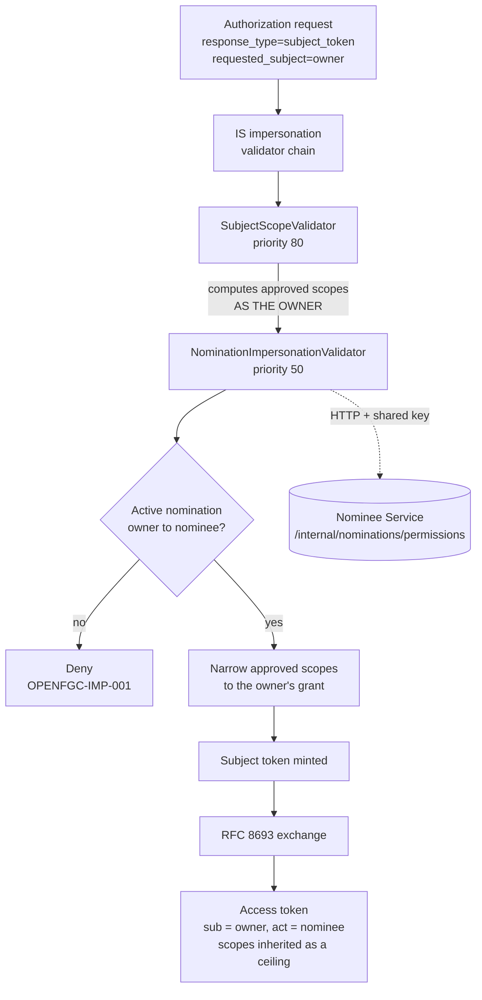

# Nomination Impersonation Validator - Extension Design

## 1. Purpose

WSO2 Identity Server can issue an *impersonation* token: a token whose subject is
one user but which was requested by another. This is what lets a nominee act on an
owner's account under the nominee's own identity.

Out of the box, IS decides whether to allow that on one question: does the caller
hold the impersonation scope? For a delegation feature that is not enough. Holding
the scope says a person may impersonate *someone*; it does not say they may
impersonate *this* person, nor how much of that person's account they may reach.

This extension supplies both missing answers. It confirms that an active
nomination exists between the two specific users, and it narrows the token's
scopes to exactly what that owner granted that nominee.

It is the only component in the system that can do this, because it is the only
one that runs *before the token exists*. Everything downstream can refuse a token;
only this can decide what the token is allowed to say.

## 2. Design principles

**Authority is decided where the token is minted.** A check applied after issuance
governs one caller. A check applied at issuance governs the token itself, and
therefore every holder of it, forever. The narrowing done here is a ceiling that
no later component can raise - not the portal backend, not Nominee Service, not a
future service that has never heard of nominations.

**The Identity Server owns identity, not nominations.** This extension never
reads the nominee database. It asks Nominee Service, over HTTP, and takes the
answer. IS therefore needs no connection string, no schema knowledge, and no
redeployment when the nomination model changes. The cost is a network call on the
mint path; the benefit is that the two systems can be versioned and operated
independently.

**Fail closed.** Every path that does not end in a confirmed active nomination
ends in a denial: an unreachable service, a timeout, a malformed response, an
unresolvable user id. A delegation system that grants access when its authority
check is unavailable is worse than one with no check, because it appears to have
one.

**Change nothing that is not ours.** The extension is additive. It registers
alongside the built-in validators rather than replacing them, and it edits only
the scopes it recognises. Scopes it does not govern pass through untouched. No IS
source is modified, and the server starts with its own stock command.

## 3. Where it sits

IS runs a chain of `ImpersonationValidator` implementations before minting a
subject token. Each may approve, deny, or adjust the request.



### Why priority 50

IS sorts validators by priority **descending**, so the *lowest* number runs
**last**.

`SubjectScopeValidator` sits at 80. It computes the approved scopes as though the
owner were making the request - it swaps the owner in as the request user,
validates, and swaps back — then calls `setApprovedScope(...)`. The result is
everything the *owner* may do.

That is the correct behaviour for impersonation in general and the wrong ceiling
for a nomination, where the owner grants each nominee a specific subset. Narrowing
it requires writing after that call. Any validator with a higher priority would
have its work overwritten. Priority 50 places this validator below the built-in
one, where its narrowing is the final word.

This ordering is a load-bearing dependency on IS internals and is the first thing
to re-check when upgrading the server.

## 4. The two decisions

### The nomination gate

The extension resolves two identifiers from the request:

| Identifier | Source | Meaning |
|---|---|---|
| owner | `ImpersonationRequestDTO.getSubject()` | the account being acted on |
| nominee | `ImpersonationRequestDTO.getImpersonator()` | the signed-in human acting |

Both must be the local user id - a UUID, not a username. The nominee id is read
from the `AuthenticatedUser`, falling back to the subject identifier and then the
masked id, since `getUserId()` is not always populated. Each fallback is accepted
only if it matches the shape of a user id, so a username never passes as one. If
neither identifier resolves, the request is denied rather than guessed at.

One call to Nominee Service answers both questions at once - whether the pairing
is active, and what it grants - keeping the mint path to a single round trip.

### Scope narrowing

The approved scopes are filtered against the permissions the owner granted:

```
for each approved scope:
    governed = SCOPE_TO_PERMISSION[scope]
    if not governed          -> retain   (not ours to judge)
    else if granted(governed) -> retain
    else                      -> drop
```

The mapping is deliberately a **deny-list over nominee-governed scopes**, not an
allow-list over everything. Scopes such as `openid` and
`internal_user_impersonate` are required for the flow itself and must survive; a
scope this extension does not recognise is not evidence of a problem, and
silently dropping it would break unrelated features. Only scopes we know how to
govern are candidates for removal.

| Scope | Requires permission |
|---|---|
| `portal:consents:read:self` | `CONSENT_VIEW` |
| `portal:consents:write:self` | `CONSENT_REVOKE` |
| `portal:consents:approve:self` | `CONSENT_APPROVE` |
| `portal:profile:read:self` | `ACCOUNT_VIEW` |
| `portal:profile:write:self` | `ACCOUNT_UPDATE` |
| `portal:profile:delete:self` | `ACCOUNT_DELETE` |

`:self` resolves to the *subject* of the token, which in an impersonation token is
the owner. That is what lets one scope set serve both a user acting for themselves
and a nominee acting for someone else. Administrative `:any` scopes appear nowhere
in this table and are never delegated.

This mapping is a contract shared with two other codebases - the portal backend's
delegatable scope list and Nominee Service's `NomineePermission` enum. A permission
added in one place and not the others is granted but unusable, or requested but
silently dropped.

## 5. Integration with Nominee Service

```
GET /internal/nominations/permissions?owner=<uuid>&nominee=<uuid>
X-Internal-Key: <shared key>

200 {"active":true,"permissions":["CONSENT_VIEW","CONSENT_REVOKE"]}
```

The endpoint carries no user token - the caller is infrastructure, not a person -
so it authenticates with a shared key compared in constant time. An unconfigured
key on the service side matches nothing, so a missing configuration closes the
gate rather than opening it.

Connect and request timeouts are three seconds each. A hanging identity provider
is a worse failure than a denied login, and the mint path must not become a place
where an unrelated outage manifests as a stalled browser.

The response is parsed with a regular expression rather than a JSON library. This
is a deliberate trade: the bundle is deployed into IS's OSGi runtime, where every
added dependency is another version conflict to resolve at bundle-resolution time,
and a bundle that fails to resolve is silently absent rather than loudly broken.
The response shape is owned by Nominee Service and is kept this simple by
agreement between the two.

## 6. Packaging

The extension is an OSGi bundle dropped into `repository/components/dropins/`.
Three packaging decisions are worth stating, because each has a failure mode that
looks like the code not running at all.

**Service registration via `BundleActivator`.** The validator is registered from a
plain activator rather than through Declarative Services. DS would require the SCR
extender to process a component descriptor; the activator only requires the bundle
to reach `ACTIVE`. IS's `OAuth2ServiceComponent` binds `ImpersonationValidator`
services with `cardinality=MULTIPLE`, so the registration is picked up either way -
the activator simply has fewer preconditions.

**Explicit unversioned imports.** Several IS packages are exported with no version.
The bundle plugin's wildcard would infer a strict range for them, which nothing can
satisfy, leaving the bundle installed but never active. Each such package is listed
explicitly with `version="[0,9)"`.

**Never import `java.*`.** Those packages are boot-delegated and not exported by
the system bundle. Importing them makes the bundle unresolvable, again silently.

Dependencies on IS jars are `system`-scoped against a specific install and are
compile-only. The versions in `pom.xml` pin the extension to the IS release it was
built for.

## 7. Startup constraint

The HTTP client is built lazily, on first use, and must stay that way.

`HttpClient.Builder#build()` resolves `SSLContext.getDefault()` when no context is
supplied, and that call permanently initialises the JVM-wide default context from
whatever truststore is configured at that instant. This bundle starts before the
server has configured its own truststore. Building a client at construction time
therefore freezes a default context that trusts only the JDK's bundled
authorities - and every later TLS client in the process inherits it, including the
server's own.

The symptom is not a TLS error in this extension. It is the IS login page
returning 404, with nothing in the log pointing here.

The rule this implies: **anything added to this bundle that opens a connection, or
touches JVM-wide default state, must be deferred until first use.** A field
initialiser or constructor in an OSGi bundle runs during server startup, in the
middle of the server configuring itself.

## 8. Security properties

**A nominee cannot reach an account they were not nominated for.** The gate is
consulted per mint, on the two specific user ids in the request.

**A nominee cannot exceed the owner's grant.** Scopes are narrowed before the
subject token exists. The exchanged access token inherits those scopes as a hard
ceiling.

**Withdrawal takes effect at the next mint.** The gate is re-read on every
impersonation request; nothing about a nomination is cached in IS. An access token
already issued remains valid until it expires - which is why the portal backend
also re-checks the live grant per request. This extension provides the ceiling,
not the revocation.

**Delegation does not chain.** Narrowing is applied to the scopes of the token
being minted. A token that already carries `act` is not a basis for minting
another; the portal backend refuses to start an acting session from a delegated
token, and this validator is never reached with one.

**Failure is denial.** Unreachable service, timeout, non-200, unparseable body,
unresolvable identifier - each returns `OPENFGC-IMP-001` and an unvalidated
context.

**The gate key is not a user credential.** It authenticates infrastructure. It
grants no access to user data on its own: the endpoint it opens answers only
whether a specific pairing is active and what it grants.

## 9. Configuration

| Property | Default | Meaning |
|---|---|---|
| `nominee.gate.url` | `http://localhost:8082` | Where Nominee Service is reachable |
| `nominee.gate.key` | `dev-impersonation-gate-key` | Shared key for the gate endpoint |

Both are JVM system properties read once at class load. The defaults suit local
development only; the key must match Nominee Service's
`impersonation-gate.internal-api-key`.


