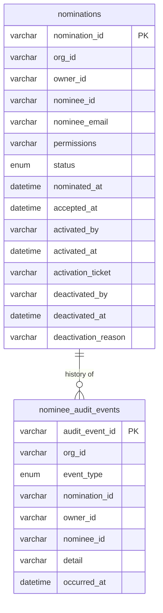

# Nominee Service - database

## Supported databases

MySQL 8, PostgreSQL 13+ and SQLite 3. One is chosen at startup with
`NOMINEE_DB_TYPE`; the service refuses to start on anything else.

There is no embedded database. The schema is created from the script in
`dbscripts/` before first start, and the service runs with `ddl-auto: validate`
— it reads and writes tables but never creates or alters them. A schema that
does not match the entity mappings stops startup rather than being silently
migrated underneath.

## What this database is for

It holds two things, and keeping them distinct is the organising idea:

1. **The authority** - who may act for whom, and within what limits.
2. **The exercise of that authority** - what a nominee actually did, including
   what they were refused.

Nothing else belongs here. Consent state lives in the Consent Server; identity
lives in the Identity Server.

### Why the acting record lives here

The Consent Server only ever observes successful writes. A nominee who reads an
owner's entire consent list, or who is refused an action, never reaches it.
Those events exist only at the delegation boundary, which this service owns.

---

## Tables



### `nominations`

One owner-to-nominee grant. `uq_owner_nominee` is on the **pair**, not the
owner: an owner may nominate any number of people, but each of them only once,
since two nominations for one pairing would mean two competing permission sets
for a single relationship.

`org_id` names the organization the row belongs to, as every table in OpenFGC
does. It is taken from the caller's token, or from the service's configured
override where the deployment's tokens carry no organization claim, and never
from the request body.

`status` moves `PENDING → ACCEPTED → ACTIVE → DEACTIVATED`. Only `ACTIVE`
permits a nominee to act. The `activated_*` columns record who approved the
nomination and against which ticket, which is where the manual verification is
evidenced; the `deactivated_*` columns record who withdrew it and why.

### `permissions`

The granted permissions, held in one column on `nominations` as a sorted
comma-separated list, for example
`CONSENT_APPROVE,CONSENT_REVOKE,CONSENT_VIEW`. Sorting means two nominations
granting the same thing store identical text.

They live here rather than in a child table because they are a small closed set
that is always loaded with its nomination and always replaced whole, so they
behave as a field of the nomination rather than as related records. Nothing
queries by permission; every reader loads the nomination and tests membership in
application code.

**Never match this column with `LIKE`.** `LIKE '%CONSENT_APPROVE%'` would also
match a future `CONSENT_APPROVE_LIMITED`, reporting an authority that was never
granted. Use an exact list match such as
`FIND_IN_SET('CONSENT_APPROVE', permissions)`.

Some permissions imply another and are stored together with it - granting
`CONSENT_REVOKE` or `CONSENT_APPROVE` also stores `CONSENT_VIEW`, since a
consent must be found before it can be acted on. A stored grant therefore always
describes something the nominee can actually carry out.

### Keys and indexes

**No foreign keys, anywhere.** `nominee_audit_events.nomination_id` holds a
`nominations.nomination_id` but is deliberately unconstrained and nullable. The
log outlives what it describes: removing a nomination must leave its history
standing, which a foreign key could only prevent or cascade away. And an attempt
to act with no nomination at all is recorded with that column null, which is
among the most important events the trail captures.

`org_id`, `owner_id` and `nominee_id` cannot be foreign keys either -
organizations and users live in the identity server, not in this database.

**The unique key's column order serves reads.** `uq_owner_nominee` is
`(owner_id, nominee_id, org_id)`. Uniqueness is identical whatever the order,
so the order is chosen to make the index useful: leading on `owner_id` lets it
answer both the gate lookup (owner + nominee, run on every acting request) and
the owner's own nominee list. Leading on `org_id` would leave both as full table
scans, because neither query filters on the organization.

**Every audit index ends in `occurred_at`**, because every read of that table is
ordered by time. Without it the database sorts the whole result set on each call.

### `nominee_audit_events`

Append-only. Rows are never updated or deleted. Carries `org_id` like every
other table; for events recorded through the internal endpoints, which carry no
user token, it is taken from the nomination the event refers to.

Holds both the nomination lifecycle (`NOMINATED`, `ACCEPTED`, `ACTIVATED`,
`PERMISSIONS_CHANGED`, `DEACTIVATED`, `REMOVED`) and the exercise of it
(`SESSION_STARTED`, `SESSION_DENIED`, `ACTION_PERFORMED`, `ACTION_DENIED`).

The acting events are written by the portal backend through
`POST /internal/nominations/audit`. They are the only record that a nominee read
an owner's data, and the only record of a refusal - neither reaches any other
system.

---

## Tamper evidence

Rows are only ever inserted. Nothing in the service updates or deletes an audit
record, so the history of what a nominee did is not affected by the nomination
later changing or being removed.

Ordering is by `occurred_at`, which is stored to microsecond precision.

The table records what happened; it does not attempt to prove that the record
itself has not been altered afterwards. Anyone with write access to the database
can change a row, and nothing here would reveal it. If that guarantee is needed,
it belongs at the database or infrastructure layer - append-only storage, audit
logging, or restricted credentials - rather than in application columns.


## Schema scripts

`dbscripts/` holds one script per database, **generated from the entity
definitions**:

```bash
mvn -q test-compile exec:java \
  -Dexec.mainClass=com.openfgc.nomineeservice.GenerateSchemaScripts \
  -Dexec.classpathScope=test
```

Generated rather than hand-written because the service validates against them at
startup. A mapping change missing from a script would otherwise surface only as
a startup failure, and only on whichever database the script forgot.

The generator applies Spring Boot's naming strategy, which turns `acceptedAt`
into `accepted_at`. Without it the scripts look correct and fail validation on
every start.

SQLite has one addition the generator cannot produce: Hibernate emits the
pairing constraint as `ALTER TABLE`, which SQLite does not support, so the
generator appends an equivalent unique index.

---

## Known limitations

**One table for two kinds of event.** Lifecycle events are rare and permanent;
acting events are written on every request. Sharing a table means they share the
append lock and the same retention. Separating them - and chaining acting events
per session rather than globally - is the next change worth making, and would
remove the lock from the request path.

**`detail` is free text.** Acting events record `permission=CONSENT_VIEW
resource=<id>` as a string, so "which consents did this nominee view in March"
is a text search rather than a query. It is `TEXT` rather than a bounded column
because this write shares the caller's transaction: a value too long would not
merely lose a log line, it would roll back the operation being logged.

**PII duplicated from the Identity Server.** `nominee_email` is a copy that goes
stale. It is kept because a nomination has to be readable without a directory
lookup, including after the nominee's account is gone.

**NIC is deliberately absent.** A national identity number was stored here
previously. It was never validated, never required, and nothing read it, while
being the most sensitive value in the schema. Under the DPDP Act storing it
needs a stated purpose and a retention position, and there was neither, so it
was removed rather than left in place unexamined.
