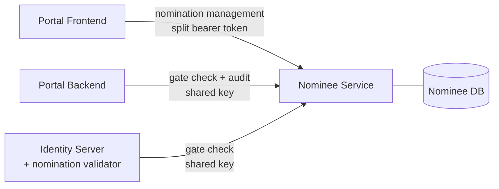
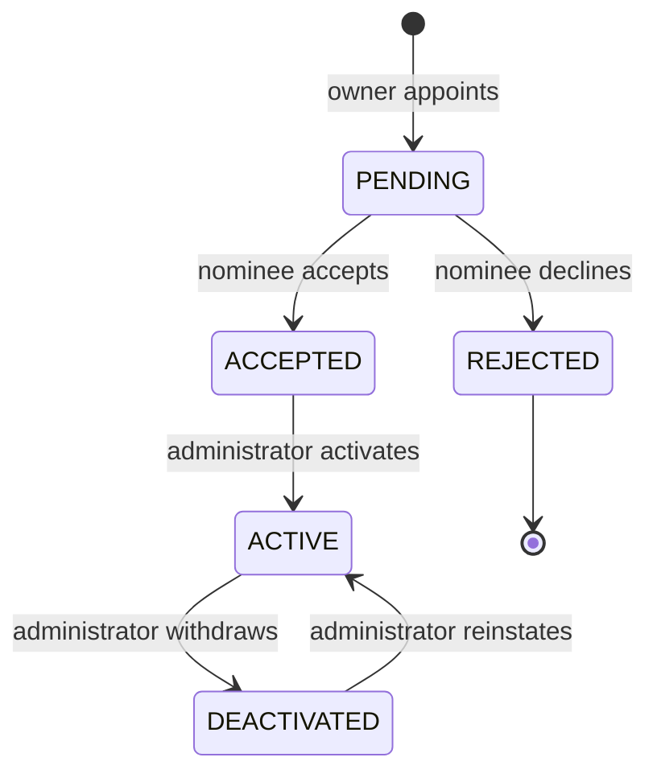

# Nominee Service - Design

## 1. Purpose

Nominee Service owns the delegation record. It is the single place that knows
which owner has appointed which nominee, what that nominee may do, whether the
appointment is currently in force, and what has happened to it.

Everything else in the system asks it. The Identity Server asks before minting a
delegated token. The portal backend asks before every acting request. Neither
holds a copy, and neither reaches into its database.

That concentration is the point. A delegation record scattered across services is
a record with no single answer to "may this person act right now" - and that
question has to have exactly one answer, available at two very different moments:
when a token is issued, and on every request made with it afterwards.

## 2. Design principles

**One owner of the record.** No other service stores a nomination, caches its
status, or infers authority from a token alone. The gate is asked, per request,
because a nomination can be withdrawn between two requests made with the same
token.

**Authority is granted by three parties, not one.** The owner decides *what*, the
nominee decides *whether*, and an administrator decides *when it becomes real*.
The service enforces that separation structurally: no single caller can drive a
nomination from creation to active.

**The caller is never trusted for identity.** Owner and nominee ids come from the
verified token, never from the request body. A known nomination id is not by
itself authority to act on it - every mutation is re-scoped to the caller.

**The record is append-only where it matters.** Nominations change state; the
audit trail does not. Audit rows are written once and never updated or deleted,
so what a nominee did survives the nomination itself being changed or removed.

**Say "not found" rather than "forbidden".** A nomination belonging to someone
else is reported as absent. Distinguishing the two confirms that an id exists,
which is information the caller has not earned.

## 3. Position in the system



Two classes of caller, authenticated differently, because they are different
kinds of thing:

| Caller | Endpoints | Authenticates with |
|---|---|---|
| A signed-in person | `/me/nominees`, `/nominations/{id}/…`, `/admin/…` | the user's split bearer token |
| Infrastructure | `/internal/nominations/…` | a shared key |

Infrastructure holds no user token - the Identity Server is asking *about* a user,
not *as* one — so bearer authentication cannot apply to it. Those endpoints are
exempted from the token filter and authenticate with a key compared in constant
time. An unconfigured key matches nothing, so a missing configuration closes the
gate rather than opening it.

## 4. Domain model

### Nomination

One owner-to-nominee pairing. An owner may have any number; DPDP Rule 14(4)
allows nominating "one or more individuals", and each nomination carries its own
permissions, status and lifecycle. Activating or deactivating one never touches
the others.

The uniqueness constraint is on the **(owner, nominee) pair**, not on the owner.
The same person may not be nominated twice by the same owner - that would create
two competing grants for one relationship - but is otherwise unrestricted. Two
parents may each nominate the same child, and that child holds two separate,
independently governed nominations.

State changes go through behaviour methods rather than setters. Each transition
sets every field that transition implies, so a nomination cannot be left half-way
between two states: an activation records the administrator, the timestamp and
the ticket together, and clears any prior deactivation so a reinstated nomination
carries no stale reason.

### Permissions

A permission is a single capability the owner grants that nominee, stored one row
per permission so a grant can be read, changed and audited one permission at a
time.

| Permission | Grants |
|---|---|
| `CONSENT_VIEW` | See the owner's consents |
| `CONSENT_REVOKE` | Revoke the owner's consents |
| `CONSENT_APPROVE` | Approve consents the owner has pending |
| `ACCOUNT_VIEW` | See the owner's profile |
| `ACCOUNT_UPDATE` | Change the owner's profile |
| `ACCOUNT_DELETE` | Close the owner's account |

Some permissions depend on another and are stored together with it:

```
CONSENT_REVOKE   →  CONSENT_VIEW     a consent must be found before it is revoked
CONSENT_APPROVE  →  CONSENT_VIEW     a consent must be found before it is approved
ACCOUNT_UPDATE   →  ACCOUNT_VIEW     a profile must be read before it is changed
ACCOUNT_DELETE   →  ACCOUNT_VIEW
```

An owner granting only `CONSENT_REVOKE` means the nominee may revoke - but a
nominee who cannot list consents can never reach one to revoke. Rather than store
a grant that cannot be exercised, the dependency is added at write time. The
owner's intent is honoured and every stored grant describes something the nominee
can actually do.

Revoking and approving are deliberately separate and neither implies the other.
They are opposite acts: revoking withdraws processing the owner already chose,
approving authorises new processing in their name. An owner who trusts a nominee
to close down data sharing has not thereby decided to let that nominee open new
sharing.

The dependency map lives in the enum's own constructor, using `Set.of` rather
than `EnumSet` - the map is built during class initialisation, before the enum is
complete, and `EnumSet` cannot resolve a type that does not yet exist.

## 5. Lifecycle



**Only `ACTIVE` confers authority.** The gate resolves to a denial in every other
state, including `ACCEPTED`. Acceptance is the nominee's consent to the role, not
a grant of it.

**Acceptance and refusal are the nominee's alone.** The caller must be the person
named on the nomination - holding the right scope is not enough, or any
authenticated user could accept someone else's nomination by id.

**Refusal is terminal.** A rejected nomination cannot be accepted afterwards.
Accepting after declining would silently reverse a recorded decision, and the
owner would have no signal that the nominee had already refused. The owner
creates a new nomination if they want to ask again, which leaves the refusal
standing in the record.

**Activation is manual and evidenced.** An administrator records a ticket
reference, which is where verification performed outside the system - identity,
relationship, legal documents - is evidenced. Automating it would make the audit
record meaningless.

### Permission freeze

Once a nomination is `ACTIVE`, the grant can only be **narrowed**.

Activation records that a specific set of permissions was verified. Widening it
afterwards would leave the nominee holding more than was reviewed while the
activation ticket still says otherwise - the audit trail would describe an
approval that never happened.

Narrowing stays open, because it only ever takes access away. An owner should
never have to wait on an administrator to reduce someone's reach. Before
activation the grant is freely editable, since nothing has been verified yet.

## 6. The gate

The question every acting request ultimately asks:

```
GET /internal/nominations/permissions?owner=<uuid>&nominee=<uuid>

200 {"active":true,"permissions":["CONSENT_VIEW","CONSENT_REVOKE"]}
```

Active status and permissions are returned together, in one call, so the caller
needs a single round trip on the request path.

The decision is computed fresh from the database on every call. Nothing is
cached. This is what makes withdrawal take effect on the next request rather than
at token expiry, and it is why the same endpoint serves both the Identity Server
at mint time and the portal backend per request - one answer, one source, two
moments.

A pairing with no nomination, or one in any state other than `ACTIVE`, returns
`{"active":false,"permissions":[]}` rather than an error. Absence is a valid
answer to the question asked.

## 7. Authorisation

### What the endpoints require

| Endpoint | Requires |
|---|---|
| `POST /me/nominees` | `portal:profile:write:self` |
| `GET /me/nominees` | `portal:profile:read:self` |
| `PATCH /me/nominees/{id}` | `portal:profile:write:self` |
| `DELETE /me/nominees/{id}` | `portal:profile:write:self` |
| `POST /nominations/{id}/accept` | `portal:profile:write:self` |
| `POST /nominations/{id}/reject` | `portal:profile:write:self` |
| `GET /nominated-for` | `portal:profile:read:self` |
| `GET /admin/nominations` | `portal:profile:read:any` |
| `POST /admin/nominations/{id}/activate` | `portal:profile:write:any` |
| `POST /admin/nominations/{id}/deactivate` | `portal:profile:write:any` |

Scope is necessary but never sufficient. Every mutation is additionally scoped to
the caller: an owner may edit only nominations they made, a nominee may accept
only nominations naming them.

### The acting-token guard

Nomination management is refused outright to anyone acting on someone else's
behalf, and this **cannot** be expressed as a scope check.

An impersonation token carries the *owner* as its subject and the scopes the
owner granted the nominee. If the owner granted `ACCOUNT_UPDATE`, that token holds
`portal:profile:write:self` - precisely the scope the nomination endpoints
require. The service would read `sub` as the owner and conclude the owner was
adding a nominee, when in fact the nominee is. They could appoint their own
accomplice on an account whose owner is dead or incapacitated and cannot object.

The scope cannot distinguish the two cases and should not have to. The distinction
is *who is holding the token*, which is exactly what the `act` and `may_act`
claims record. Both are checked, because the two stages of the delegation flow use
different ones: `may_act` on the subject token, `act` on the exchanged access
token. Either one present means the caller is not the subject acting for
themselves.

**Delegation is not transitive.** The owner chose one person. That person may
exercise the owner's data rights; they may not extend the owner's trust to anybody
else.

### Split token resolution

The portal issues an access token in two halves: part 1 travels as an ordinary
`Authorization: Bearer` header, part 2 as an HttpOnly cookie. Neither half alone
is a valid JWT - only the concatenation is, so a token stolen from JavaScript is
useless without the cookie, and a stolen cookie is useless without the header.

Cookies are not port-scoped, so the same cookie set by the backend on port 8080 is
sent to this service on 8082, and the two halves can be rejoined here without any
coordination between the services.

## 8. Audit

Every lifecycle event and every acting event is appended to one table.

| Category | Events |
|---|---|
| Lifecycle | `NOMINATED`, `PERMISSIONS_CHANGED`, `ACCEPTED`, `REJECTED`, `ACTIVATED`, `DEACTIVATED`, `REMOVED` |
| Acting | `SESSION_STARTED`, `SESSION_DENIED`, `ACTION_PERFORMED`, `ACTION_DENIED` |

Acting events arrive from the portal backend over the internal endpoint. A nominee
reading an owner's records, and a nominee refused an action, are both events that
only the backend observes - they are recorded here or nowhere. The nomination is
resolved from the owner-nominee pair rather than taken from the caller, so an
event cannot be attributed to an unrelated nomination. A pair with **no**
nomination is still recorded, with a null nomination id: an attempt to act without
one is exactly the kind of event the trail exists to capture.


## 9. Data model

| Table | Holds |
|---|---|
| `nominations` | one row per owner-to-nominee pairing, with its granted permissions, status and lifecycle timestamps |
| `nominee_audit_events` | the append-only record of what happened |

Both carry `org_id`, as every table in OpenFGC does. It comes from the caller's
token, or from the service's configured override where the deployment's tokens
carry no organization claim, and never from the request body.

Permissions are one column on the nomination rather than a child table. They are
a small closed set, always loaded with the nomination and always replaced whole,
and nothing queries by permission - every reader loads the nomination and tests
membership in application code. A child table would add a join and a second
place to carry the organization id, for no reader that wants either.

Lifecycle actors and timestamps live on the nomination itself - who activated it,
when, against which ticket; who deactivated it, when, and why. These duplicate
information also present in the audit records, deliberately: the current state
of a nomination should be answerable without reading an audit trail.

### Three databases

MySQL, PostgreSQL and SQLite are supported, selected by profile, each with its own
schema script. The application never creates its schema at runtime - Hibernate is
set to `validate`, so a mismatch between the code and the applied script fails at
startup rather than being silently patched into a shape no script describes.

Names are mapped with the snake-case naming strategy, which is what the scripts
are written in. A generated script that disagrees with the runtime mapping is a
schema that validates in development and fails in deployment.

## 10. Failure behaviour

**Unknown or foreign nomination** - `404`, never `403`. See §2.

**Duplicate nomination** - `409`. The pair already exists.

**Self-nomination** - rejected. Appointing yourself is not delegation, and would
create a record whose gate answer is meaningless.

**Widening a frozen grant** - `409`, naming the nomination. Distinguished from an
ordinary rejection because the owner's request was legitimate; it is the timing
that is not.

**Acting caller** - `403`. The token is valid; the holder is not permitted to
manage nominations with it.

**Wrong internal key** - `401`, with no detail. Infrastructure callers get no
information about why.

## 11. Security properties

**A nominee cannot grant themselves anything.** Creating and editing a nomination
requires being the owner, and is refused entirely while acting.

**A nominee cannot act before three parties agree.** Owner grants, nominee
accepts, administrator activates. The gate answers `false` until all three have
happened.

**Withdrawal is immediate.** The gate is computed per call with no caching, so a
deactivation takes effect on the very next request made with an existing token.

**A grant cannot grow behind an administrator's back.** The freeze holds the
verified permission set as a ceiling for as long as the nomination is active.

**An action cannot be silently disowned.** Acting events are recorded against the
resolved owner-nominee pair, including attempts made with no nomination at all.

**The audit trail cannot be edited one row at a time.** Any single-row change
breaks the chain from that point onward.

## 12. Future work

**Notifications.** Owners and nominees are not told when a nomination is created,
accepted, activated, changed or withdrawn. The events exist; delivery does not.
This matters most for withdrawal, where the affected party currently learns only
by being refused.

**Enforcing the profile permissions.** `ACCOUNT_VIEW`, `ACCOUNT_UPDATE` and
`ACCOUNT_DELETE` can be granted, are stored, and are carried in the delegated
token - but no endpoint consumes them yet. `ACCOUNT_DELETE` in particular
deserves its own review before implementation, being irreversible.

