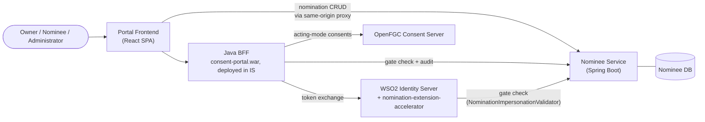
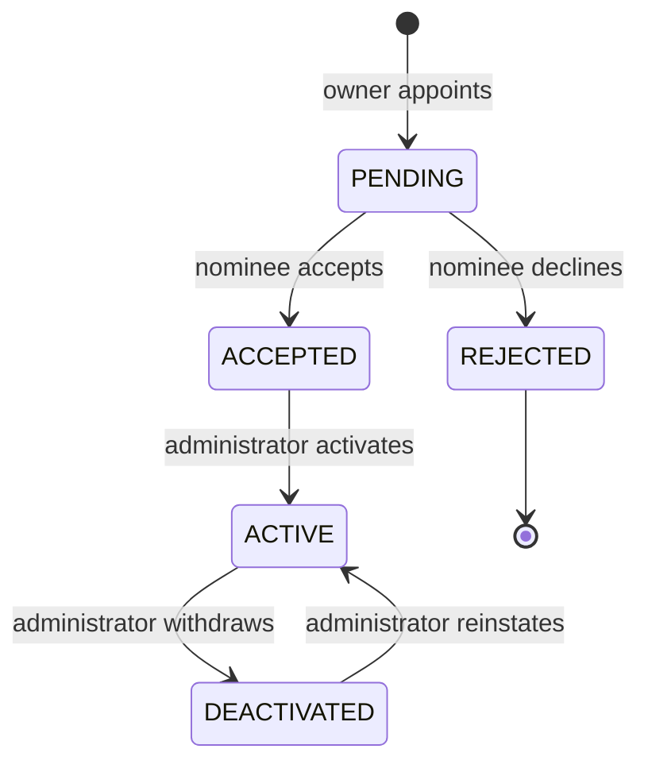
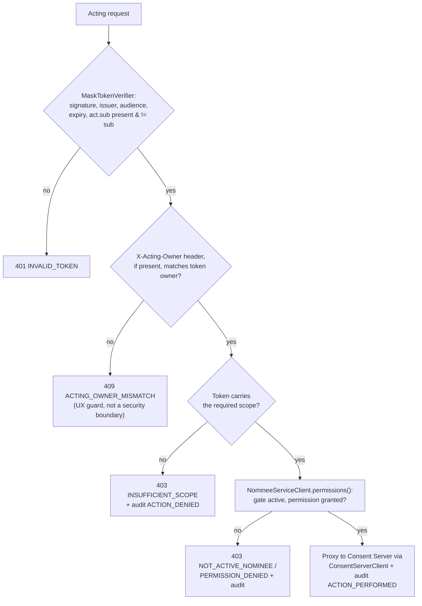
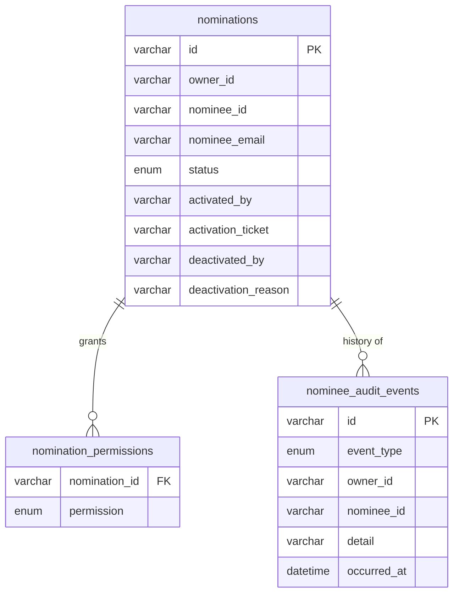

# Nomination (Delegated Access) — Feature Design

This document covers the nomination feature end to end as implemented in
**this repository**: the WSO2 Identity Server extension, the Java
backend-for-frontend (BFF) inside `consent-portal`, Nominee Service, and the
portal frontend. It is the java/WSO2-IS-native counterpart to the reference
design at `portal/NOMINATION-DESIGN.md` in the sibling Go-based project — the
authorization model, lifecycle and enforcement rules are intentionally
identical; only the mechanics of *how* each layer is built differ.

## 1. Purpose

Section 14 of the Digital Personal Data Protection Act allows a Data
Principal to nominate one or more individuals who may exercise their rights
on their behalf, in the event of death or incapacity.

This feature implements that: an account owner appoints nominees, decides
what each may do, and an administrator verifies the appointment before it
takes effect. A nominee then acts on the owner's account under their own
identity, within the owner's grant, with every action recorded.

## 2. Design principles

**The nominee is never anonymous.** A nominee acts *as themselves on behalf
of* the owner, never *as* the owner. Every token, every request and every
audit entry names both parties.

**Authority is granted in three steps, by three different parties.** The
owner decides *what*, the nominee decides *whether*, and an administrator
decides *when it becomes real*. No single party can create working access
alone.

**Authority is checked continuously, not once.** A token proves what was
granted when it was issued. The nomination is re-read on every request, so
withdrawal takes effect immediately rather than at token expiry.

**Delegation does not compound.** A nominee exercises the owner's rights but
never inherits the owner's ability to delegate. They cannot appoint further
nominees, and they never hold administrative standing.

## 3. Concepts

| Term | Meaning |
|---|---|
| **Owner** | The Data Principal whose account and data are involved |
| **Nominee** | A person the owner has appointed to act on their behalf |
| **Nomination** | One owner-to-nominee appointment, with its own permissions and lifecycle |
| **Permission** | A single capability the owner grants that nominee |
| **Acting session** | A period during which a nominee is operating on an owner's account |
| **Mask token** | This repo's name for the delegated (impersonation) access token — `sub`=owner, `act.sub`=nominee |

An owner may appoint any number of nominees, and a person may be nominated by
several owners. The uniqueness rule is on the **pair**: the same person
cannot be nominated twice by the same owner.

## 4. Architecture



| Component | This repo's implementation |
|---|---|
| **Identity Server** | WSO2 IS 7.3.0. Authenticates people; issues the delegated (mask) token via its own RFC 8693-adjacent impersonation flow, having asked whether the nomination permits it. |
| **Nomination validator** (IS extension) | `components/nomination-extension-accelerator` — an OSGi bundle (`NominationImpersonationValidator` + `NominationValidatorActivator`) dropped into IS's `dropins/`. Confirms an active nomination and narrows scopes before a subject token is minted. See [§7](#7-nomination-flow). |
| **Nominee Service** | `internal-webapps/nominee-service` — a Spring Boot service, a straight copy of the sibling project's Java service (unmodified). Owns the nomination record, the gate decision, and the audit trail. |
| **Java BFF** | `react-apps/consent-portal/src/main/java/.../portal/webapp/` — a set of servlets deployed as part of `consent-portal.war` inside WSO2 IS itself (not a standalone process). Drives the delegation exchange, enforces every acting request, and proxies to the Consent Server. See [§9](#9-java-bff-implementation-inventory). |
| **Portal Frontend** | `react-apps/consent-portal/frontend/src/features/nominee/` — owner, nominee and administrator interfaces. |
| **Consent Server** | The standalone OpenFGC Consent Server (Go, external to this repo). Holds consents; knows nothing about nominations, receiving only the acting party as the recorded actor. |

**Nominee Service owns the delegation record, and nothing else does.** The
Identity Server has no access to its database; it asks a question over HTTP.
The same answer serves both the moment a token is issued (via the IS
extension) and every request made afterwards (via the BFF).

## 5. Authorisation model

### Roles

Provisioned in Identity Server against a "Portal Consent API" resource
(`https://api.openfgc.local/portal`):

| Role | Held by | Purpose |
|---|---|---|
| `PortalUser` | every user | Owners and nominees alike — the same person is an owner of their own data and a nominee of somebody else's |
| `PortalAdmin` | administrators | Reviewing and activating nominations; managing the consent purpose/element catalog |

### Scopes

| Scope | Meaning |
|---|---|
| `portal:consents:read:self` | Read the token subject's consents |
| `portal:consents:write:self` | Revoke the token subject's consents |
| `portal:consents:approve:self` | Approve the token subject's pending consents |
| `portal:profile:read:self` | Read the token subject's profile |
| `portal:profile:write:self` | Change the token subject's profile |
| `portal:profile:delete:self` | Delete the token subject's account |
| `portal:profile:read:any` | Read any account (administrative) |
| `portal:profile:write:any` | Change any account (administrative) |

`:self` means *the subject of this token*. In a mask token the subject is
the **owner**, so the same scope vocabulary covers a user acting for
themselves and a nominee acting for someone else — `:any` is never
delegatable, since it would reach beyond the one owner the nomination
concerns. The Java BFF's `ScopeMapper` passes these scopes through verbatim
from whatever Identity Server actually issues (see [§9](#9-java-bff-implementation-inventory)).

### Permissions

What an owner grants a nominee, distinct from OAuth scopes, stored by
Nominee Service:

| Permission | Grants |
|---|---|
| `CONSENT_VIEW` | See the owner's consents |
| `CONSENT_REVOKE` | Revoke the owner's consents |
| `CONSENT_APPROVE` | Approve consents the owner has pending |
| `ACCOUNT_VIEW` | See the owner's profile |
| `ACCOUNT_UPDATE` | Change the owner's profile |
| `ACCOUNT_DELETE` | Close the owner's account |

`CONSENT_REVOKE`/`CONSENT_APPROVE`/`ACCOUNT_UPDATE`/`ACCOUNT_DELETE` each
imply the permission that must hold alongside them (`CONSENT_VIEW`,
`ACCOUNT_VIEW` respectively) — a stored grant always describes something the
nominee can actually carry out.

Permission → scope, applied by the IS extension when narrowing a mask
token's approved scopes:

| Permission | Scope carried |
|---|---|
| `CONSENT_VIEW` | `portal:consents:read:self` |
| `CONSENT_REVOKE` | `portal:consents:write:self` |
| `CONSENT_APPROVE` | `portal:consents:approve:self` |
| `ACCOUNT_VIEW` | `portal:profile:read:self` |
| `ACCOUNT_UPDATE` | `portal:profile:write:self` |
| `ACCOUNT_DELETE` | `portal:profile:delete:self` |

Only the `CONSENT_*` permissions have a consuming endpoint today in the Java
BFF (`ActingConsentsServlet`) — see [§13](#13-known-gaps--future-work).

## 6. Nomination lifecycle



Only `ACTIVE` confers authority. Activation is deliberately manual — an
administrator records a ticket reference, evidencing verification performed
outside the system. Refusal is terminal. Withdrawal is immediate in effect:
a mask token already issued stays cryptographically valid, so it is the
per-request gate check, not expiry, that stops the nominee.

| When | Add a permission | Remove a permission | Remove the nomination |
|---|---|---|---|
| Before activation | yes | yes | yes |
| After activation | **no** | yes | yes |

## 7. Nomination flow

Establishing an acting session, in two stages — this is where this repo's
mechanics diverge visibly from the Go reference, since Identity Server's
own extension point chain does the scope narrowing rather than a
hand-written validator inside the BFF.

```mermaid
sequenceDiagram
    participant N as Nominee (browser)
    participant FE as Frontend
    participant BFF as Java BFF<br/>(ActingAuthServlet)
    participant IS as Identity Server
    participant V as NominationImpersonationValidator<br/>(priority 50)
    participant NS as Nominee Service
    participant DB as Nominee DB

    Note over N,DB: Stage 1 — mint the subject token
    FE->>BFF: GET /acting-api/start?ownerId
    BFF-->>N: redirect to IS authorize<br/>(built by ImpersonationClient)
    N->>IS: authorize (response_type=id_token subject_token,<br/>requested_subject=owner)
    IS->>IS: identify nominee from its own session
    IS->>IS: run impersonation validator chain<br/>(SubjectScopeValidator @80, then this @50)
    IS->>V: validateImpersonation(context)
    V->>NS: GET /internal/nominations/permissions?owner&nominee<br/>X-Internal-Key
    NS->>DB: read nomination + permissions
    DB-->>NS: status + granted permissions
    NS-->>V: {"active":true,"permissions":[...]}
    alt active
        V->>V: filter approved scopes via<br/>SCOPE_TO_PERMISSION deny-list map
        V-->>IS: validated, scopes narrowed
        IS-->>N: redirect carrying subject token<br/>(sub=owner, may_act=nominee)
    else not active / unreachable / malformed
        V-->>IS: deny (fail-closed, OPENFGC-IMP-001)
        IS-->>N: no token issued
    end

    Note over N,DB: Stage 2 — exchange it
    N->>BFF: POST /acting-api/exchange {subjectToken, state}
    BFF->>BFF: verify state cookie (constant-time compare)
    BFF->>IS: RFC 8693 token exchange<br/>subject_token + actor_token (caller's own login token)
    IS->>IS: actor_token.sub must equal subject_token.may_act.sub
    IS-->>BFF: mask token (sub=owner, act.sub=nominee)
    BFF->>BFF: MaskTokenVerifier: signature, issuer, audience,<br/>act.sub present and != sub
    BFF->>NS: NomineeServiceClient.record(SESSION_STARTED)
    NS->>DB: append audit event
    BFF-->>N: portal-acting-token cookie set;<br/>{ownerId, nomineeId, scopes, expiresAt}
```

### Why two stages

The subject token cannot be minted server to server — Identity Server
identifies the impersonating party from an interactive session, not a
bearer token, so stage 1 must originate in the nominee's browser
(`ActingAuthServlet.startActing` performs a real `sendRedirect`, never a
fetch). The exchange in stage 2 requires the nominee's own current access
token as `actor_token`, binding it to the party named in the subject
token's `may_act` claim; it runs server-side because it needs the OAuth
client secret.

### The IS extension in detail

`NominationImpersonationValidator` implements Identity Server's
`ImpersonationValidator` SPI:

```java
public int getPriority() { return 50; }
public ImpersonationContext validateImpersonation(ImpersonationContext context)
```

IS runs its chain of validators in descending priority order. The built-in
`SubjectScopeValidator` (priority 80) computes the owner's own approved
scopes first; this validator, at priority 50, runs *after* it and is
therefore the last one to write `approvedScope` — a load-bearing ordering
dependency on IS internals, documented in the component's own DESIGN.md.

It resolves `ownerId` from `ImpersonationRequestDTO.getSubject()` and
`nomineeId` from `getImpersonator()`, each validated against a UUID-shaped
regex before use. It then calls Nominee Service's gate endpoint once, and
narrows `context.getApprovedScope()` using a **deny-list** map
(`SCOPE_TO_PERMISSION`) — scopes it doesn't recognize (`openid`,
`internal_user_impersonate`, …) pass through untouched; only the `portal:*`
scopes present in the map are checked against the granted permissions and
dropped if not present.

Everything fails closed: an unreachable Nominee Service, a timeout, a
non-200, an unparseable body, or an unresolvable owner/nominee id all deny
with error code `OPENFGC-IMP-001`.

One implementation detail worth preserving if this component is ever
touched: its `HttpClient` is built lazily, behind double-checked locking,
rather than at construction — `HttpClient.Builder#build()` resolves
`SSLContext.getDefault()` on first call, and doing that eagerly would
freeze a JVM-wide TLS default (trusting only the JDK's bundled CAs) before
IS finishes configuring its own truststore, silently breaking IS's *own*
login page with no obviously-related log line.

## 8. Enforcement

Two independent layers inside the Java BFF's `ActingConsentsServlet.enforce()`,
both of which must pass on **every** acting request, not just at token mint:



**Layer one — the scope ceiling**, fixed by the IS extension when the mask
token was minted. A nominee granted view-only holds a token that never
carried the write scope, so a revoke is refused before the gate is even
consulted (`mask.hasScope(requiredScope)` in `ActingConsentsServlet`).

**Layer two — the live gate**, re-read via `NomineeServiceClient.permissions()`
on every request. This is what makes withdrawal take effect immediately,
and what catches a permission removed after the token was issued.

Both fail closed: if the gate cannot be reached, `enforce()` returns 502
rather than proceeding.

### Boundaries

- **First-party routes refuse delegated tokens implicitly** — every
  non-`/acting-api/*` route validates the login split-token cookie pair via
  `AuthUtil`/`TokenValidator`, which a mask token was never issued as (it
  lives in the separate `portal-acting-token` cookie).
- **Nomination management refuses delegated tokens** — enforced inside
  Nominee Service itself (`ActingTokenGuard`), not the Java BFF, since
  nomination CRUD goes to Nominee Service directly via
  `NomineeServiceProxyServlet`'s same-origin passthrough.
- **Administrative standing is never delegated** — an administrator acting
  for an owner acts as that owner, holding no administrative capability for
  the session's duration.

### One acting session per browser

The mask token lives in a single HttpOnly cookie (`portal-acting-token`) at
one path (`config.getPortalBasePath()`), so a browser has one acting
session however many tabs are open. `X-Acting-Owner` lets a tab state which
owner it believes it is acting for; a mismatch against the token's actual
owner is refused with `409 ACTING_OWNER_MISMATCH` — this resolves a stale-tab
disagreement, it is **not** an authorization boundary (an absent header
asserts nothing and is allowed).

Both login and logout (`OAuthLoginServlet`, `AuthLogoutServlet`) also clear
`portal-acting-token`/`portal-acting-state`, since a mask token is bound to
whoever was acting when it was minted, not to the current login session — a
gap found and fixed during this feature's initial rollout.

## 9. Java BFF implementation inventory

All under `react-apps/consent-portal/src/main/java/org/wso2/dpdp/accelerator/portal/webapp/`:

| File | Role |
|---|---|
| `servlet/NomineeDirectoryServlet.java` | `/nominees/lookup`, `/users/{id}`, `/admin/users/search` — SCIM identity lookups |
| `servlet/ActingAuthServlet.java` | `/acting-api/start\|exchange\|stop` — the two-stage flow in [§7](#7-nomination-flow) |
| `servlet/ActingConsentsServlet.java` | `/acting-api/consents*` — the enforcement in [§8](#8-enforcement) |
| `servlet/NomineeServiceProxyServlet.java` | `/nominee-service/*` — transparent same-origin reverse proxy for nomination CRUD (add/accept/reject/activate), documented in the frontend's env but previously unimplemented anywhere |
| `client/ScimClient.java` | Client-credentials SCIM2 directory client — email/id lookup, admin-role membership walk |
| `client/ImpersonationClient.java` | Builds the IS authorize URL (stage 1) and performs the RFC 8693 exchange (stage 2) |
| `client/ConsentServerClient.java` | Thin HTTP client for the OpenFGC Consent Server (`org-id`/`group-id` headers, no bearer forwarded) |
| `client/NomineeServiceClient.java` | The live gate check and audit event recording |
| `service/MaskTokenVerifier.java` | JWKS-backed verification of the mask token, requiring `act.sub` |
| `service/ConsentPayloadUtil.java` | Consent approval/rejection payload shaping, shared with the first-party (non-acting) consent flow so "approved by the owner" and "approved by their nominee" produce identical records |
| `service/ScopeMapper.java` | Passes `portal:*` scopes from the login token through to the SPA's `/me` response, gating UI visibility (e.g. the Nominations tab needs `portal:profile:read:self`) |

Frontend, under `frontend/src/features/nominee/`: `NominationsPage.tsx`,
`NomineeManagePage.tsx`, `NomineeConsentDetailsPage.tsx`,
`api/nomineeApi.ts`, `hooks/useNomineeQueries.ts`,
`components/{AddNomineeDialog,RemoveNomineeDialog,BulkRevokeDialog,NomineeConsentTable,PersonCell,UserDisplayName}.tsx`,
`actingAs/{actingApi,actingAsContext,policy}.ts`,
`actingAs/{ActingAsProvider,ActingCallbackPage,ActingExitButton,ActingAsGuard,StartActingPage}.tsx`.

## 10. Data model

Owned entirely by Nominee Service (`internal-webapps/nominee-service`,
unmodified from the sibling project):



Supported on MySQL, PostgreSQL and SQLite; schema created from a per-database
script, validated (not altered) at startup.

## 11. Audit

Append-only; never updated or deleted.

| Event | Recorded by |
|---|---|
| `NOMINATED`, `ACCEPTED`/`REJECTED`, `ACTIVATED`/`DEACTIVATED`, `PERMISSIONS_CHANGED`, `REMOVED` | Nominee Service (lifecycle, driven by the frontend's direct calls) |
| `SESSION_STARTED`/`SESSION_DENIED` | Java BFF's `ActingAuthServlet` via `NomineeServiceClient.record()` |
| `ACTION_PERFORMED`/`ACTION_DENIED` | Java BFF's `ActingConsentsServlet.enforce()` via `NomineeServiceClient.recordAction()` |

Reads and refusals are recorded here or nowhere — the Consent Server
observes only successful writes. Actions on consents are additionally
recorded there with the **nominee** as the acting party, never the owner.

## 12. Security properties

| Property | How it holds in this implementation |
|---|---|
| A nominee cannot exceed the owner's grant | Scopes narrowed by `NominationImpersonationValidator` at mint; gate re-checked per request by `ActingConsentsServlet` |
| A withdrawn nomination stops access at once | `NomineeServiceClient.permissions()` is called on every acting request, not cached |
| A stolen subject token is not usable alone | Exchange requires the nominee's own `actor_token`; `ImpersonationClient` never sends one without the other |
| A delegated token cannot be replayed on ordinary routes | Mask token lives only in `portal-acting-token`, a cookie no first-party route reads |
| A nominee cannot appoint further nominees | Enforced by Nominee Service's `ActingTokenGuard`, ahead of the BFF |
| Actions are attributed to the real person | `mask.getNominee()` is the recorded `actionBy`/audit actor throughout |
| Log injection from token claims/headers | `LogUtil.safe()` strips CR/LF before any user-influenced value reaches a log line |
| Infrastructure callers cannot be impersonated | `X-Internal-Key` shared secret, both in the IS extension and the BFF's `NomineeServiceClient` |
| A missing dependency denies rather than allows | Gate failure, verifier failure, and missing config all refuse (502/401), never silently permit |
| Wrong-tenant data never leaks | `org-id` sent to the Consent Server is the mask token's raw `org_id` claim, not the display-oriented `org_handle` — a bug found and fixed during rollout (see [§13](#13-known-gaps--future-work)) |

## 13. Known gaps / future work

**Deployment automation.** Unlike the consent-portal OAuth app registration
(fully scripted in `accelerators/dpdp-is/bin/register-portal-app.sh`),
nothing in this repo automates: dropping the `nomination-extension-accelerator`
jar into IS's `dropins/`, enabling the impersonation grant on IS, or setting
the extension's `nominee.gate.url`/`nominee.gate.key` JVM system properties.
This is currently manual, per the extension's own README.

**Profile permissions unused.** `ACCOUNT_VIEW`/`ACCOUNT_UPDATE`/`ACCOUNT_DELETE`
can be granted by an owner and are narrowed into the mask token exactly like
the consent permissions, but no Java BFF endpoint consumes them yet — only
`ActingConsentsServlet` (consent view/revoke/approve) exists.
`ACCOUNT_DELETE` in particular deserves its own review before
implementation, being irreversible and high-value.

**Notifications.** Nominees and owners are not told when a nomination is
created, accepted, activated, changed or withdrawn. The audit events exist;
delivery does not.

**Two consent backends coexist.** Self-service/admin consent management
(`MyConsentsServlet`, most of `AdminApiServlet`) and acting-mode consent
management (`ActingConsentsServlet`) both now target the OpenFGC Consent
Server, but the Consent Server is a separate process this repo does not
start or manage — it must be running independently for any consent-bearing
part of the nomination flow (viewing/approving/revoking while acting) to
work end to end.
